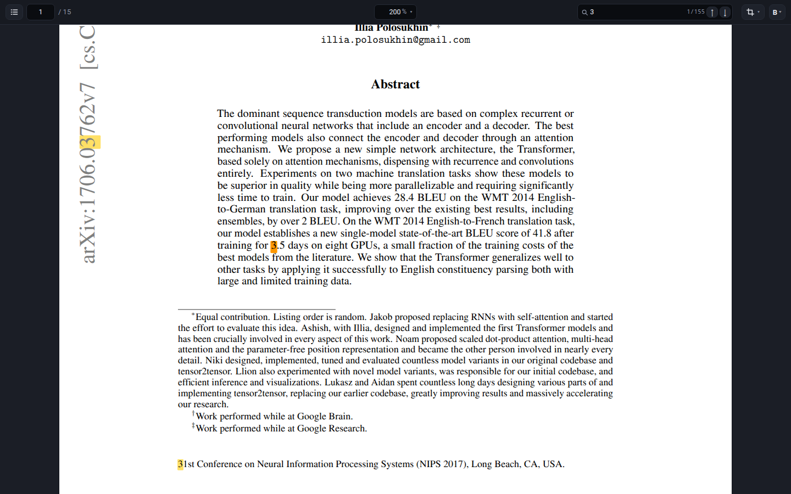

# webpdf

Read a PDF in the browser: every page is an SVG, and **the text is real text** —
selectable, searchable, copyable, hintable, and tiny — instead of thousands of
glyph outlines.



The repository is two halves and a host between them:

* **`core/`** — Rust. It links MuPDF (the `mupdf` crate), reads the document,
  plans the document's fonts, and writes each page's final SVG itself. Built to
  WebAssembly by Emscripten (`npm run build:wasm`), it is the only thing here
  that reads a PDF.
* **`demo/`** — the viewer. The bar, the outline, the search, the crop menu, the
  reader's memory, the service worker, and `demo/core/`, the thin layer that
  speaks the core's protocol in TypeScript. It is also the page the extension
  frames.

There is no JavaScript PDF library left. The pipeline that built fonts out of
MuPDF's SVG with opentype.js, `text-vide` and a `<use>`-to-`<text>` rewriter is
gone, along with the npm package it was published as: what it did is now what
the core does, in Rust, in one pass.

---

## The problem

MuPDF can already emit SVG two ways, and neither is what a document viewer wants:

| mode | output | problem |
| --- | --- | --- |
| `text=text` | `<text font-family="…">` with the characters | only correct if the *browser* has that font. It almost never does: PDFs embed subsets, and a browser cannot use a Type 1 (PFB/PFA) font at all. Get it wrong and the page reflows into the wrong typeface. |
| `text=path` | `<use>` per glyph, referencing outlines in `<defs>` | always correct, but a single page becomes ~400 KB of paths with no selectable text. |

A third option — bundling a fixed set of fonts, or patching MuPDF to emit text
only for those — does not generalise: every LaTeX paper embeds a different
subset, and `/FontFile`-style Type 1 fonts, which pdfTeX emits constantly, are
not usable as web fonts in the first place.

## The approach

**Ask MuPDF for the glyphs and for the letters, build the font that joins them,
and write the SVG once.**

```
PDF page
   │
   │  one pass over the page, two devices
   ├─ glyph device ──► every outline, in em units, y-up, per embedded font
   └─ text device  ──► every character, its position, and the letters a
                       ligature was drawn for
   │
   │  per font, for the whole document: outlines → CFF charstrings → sfnt
   │  with a cmap, and a GSUB `liga` rule for the ligatures
   │
   │  the core writes the page:  <text> for the runs it can prove,
   │                             <path> for everything else
   ▼
SVG with real text, plus outlines kept for whatever could not be converted
```

The last step is the part that used to be a second pass in JavaScript. It is not
any more: the core holds the faces, the glyph placements and the letters at the
same moment, so it emits the final string directly — no base SVG is built and
then rewritten, and there is no state that a post-processing step could disagree
with it about.

### Why this works

* **No font parsing.** The PDF's embedded font program is never touched. MuPDF
  (through FreeType) has already resolved every font — embedded CFF, raw Type 1
  PFB/PFA, TrueType, substituted base-14 faces, CJK — into normalised outlines.
  Those outlines go into the generated font *as they are*: a `CFF ` table's
  charstrings are cubic like MuPDF's, so there is no approximation step at all
  and the browser draws the same curve MuPDF would have drawn as a path — to the
  1/1000 em grid the coordinates are rounded onto.
* **Type 1 is not a special case.** A PFB is simply a font whose outlines MuPDF
  read for us. The pdfTeX paper the demo opens from arXiv embeds five
  `/FontFile` Type 1 fonts, and every one of them comes back as text.
* **Positioning comes from MuPDF.** The text device reports one position per
  character, so the browser never has to agree with us about advances, kerning or
  shaping: the run's `x` list is MuPDF's own.
* **The font is built once per *font*, for the whole document.** That is what the
  plan is (`Plan` in `core/src/font/plan.rs`): the core walks every page, collects
  the glyphs each font was drawn with, and compiles one face per font. A page then
  names the document's faces instead of carrying its own, which is what makes the
  pages one document — registering a face re-lays-out every text run in the
  document it is registered in, so it is done once and all at once rather than
  once per page.
* **The plan is cheap.** Walking 756 pages and building 48 faces takes **0.92 s**
  natively and a few seconds in wasm; the 100-page GPT-4 report is **0.20 s** and
  87 faces. It still runs in slices (`wpdf_plan(id, pages)`) so the page stays
  alive while it does, and it starts the moment a document is open.

### Character mapping

Each glyph is reachable under a real Unicode value where MuPDF recorded one, so
copy, search and screen readers work. A ligature is the case that needs help: the
glyph device names a glyph by the *first* of the letters it was shown with — the
one glyph a typesetter drew for `fi` arrives as `f` — and a document whose own
encoding is honest about it names the glyph `U+FB01` instead. Both are the same
claim written two ways, and neither says *which* two letters the glyph is made
of: only the text device knows, because it takes the ligature apart and reports
one character per letter.

So the text carries the **letters** — `first` stays `first`, which is what a
reader searches for, selects and copies — and the glyph is still the one the page
drew, because the face is built with a `liga` rule: asked for `fi`, the shaper
finds `f`+`i` → the ligature glyph. A glyph written as several characters is
emitted in a `<tspan>` of its own with one position rather than a position per
character, because a browser only joins letters it lays out together.

Only what is left over falls back to a code point from the BMP Private Use Area
(`U+E000…U+F8FF`), with a `cmap` entry pointing at the right outline, so nothing
renders blank.

### Falling back

Anything not provably safe stays an outline, glyph by glyph:

| situation | behaviour |
| --- | --- |
| Type 3 font, bitmap-only glyph | the outline is kept |
| glyph with no usable letters from the text device | the outline is kept |
| stroked text | the outline is kept |
| right-to-left or complex-shaping scripts | the outline is kept (see limitations) |
| the page could not be walked when the plan ran | every glyph of it stays an outline |

There is no configuration in which the output is *wrong*; the worst case is the
older, larger, still-correct representation. And an outline is pixel-identical to
the text it replaces: same glyph, same position, same paint.

### One document, and the iframe-per-page that is gone

An earlier design drew every page inside its own `<iframe>`, and gave each frame
the faces *that page* needed. That was not a layout choice and not an
implementation convenience: it was the only way to stop a page's fonts from
repainting the rest of the document, and it is worth writing down why, because
the reason it existed is gone.

Registering a `@font-face` is not an incremental change to a document. The
browser adds the face to the document's font set and then re-lays-out every text
run in that document, to find out whether any of them now resolves to something
else. Measured in Chromium, adding **one** face to a document holding a 15-page
paper touched **3347 nodes and cost 112.9 ms** — several dropped frames, for one
face. The old per-page pipeline (`src/`, since deleted) built one face per page,
out of the glyphs that page happened to draw, so every page arriving minted a new
family and registered it: a page boundary was a whole-document repaint. The frame
was the isolation that made that survivable — a page's faces landed in the page's
own document, where no other page could be invalidated by them.

None of that is needed now, because the core does not build fonts per page. It
builds **one face per *font*, for the whole document** (`Plan`,
`core/src/font/plan.rs`), and the viewer writes every one of those faces into the
single document **once**, before the first page is drawn (`wpdf_stylesheet`). One
write, one re-layout, and never again: a page drawn later names families the
document is already carrying, so it registers nothing and invalidates nothing.
There is no per-page face left to isolate, so there is nothing for a frame to
isolate — and with the frame gone the pages share one document, which is what
gives the reader selection across pages, find-in-page over the paper, and a
caret.

The one case where a face is written late at all is a page drawn before the plan
is ready, which is what *Draw at Once, Then Text* is for. That page is drawn as
**outlines**, and outlines name no face: they are paths. It is drawn again once
the plan lands, and the document's faces went in before that redraw. So even
there the write happens once, and there is still no per-page face and still
nothing a frame would absorb.

---

## Results

Measured with the core built for the browser — the wasm module itself, driven
directly in Node — rendering page 1 of the papers in the test corpus (all public
URLs, `demo/papers.mjs`):

| document | glyphs | as text | SVG | runs | faces in the plan |
| --- | --- | --- | --- | --- | --- |
| *Attention Is All You Need*, p1 (5 Type 1/PFB fonts) | 2464 | 2464 | 132 KB | 57 | 33 for the document |
| *GPT-4 Technical Report*, p1 | 2917 | 2917 | 160 KB | 54 | 87 for the document |

The old pipeline's outline SVG for the same pages was 373 KB and 398 KB, so the
text render is a little over a third of it, with the whole page selectable.

* **The crop agrees with the JavaScript it replaced.** The same marks over
  the same pages were measured both ways: 664 boxes compared, 21 differed, and
  every one of the 21 is a page the two MuPDF versions read different text on
  (1.28.1 in the npm package, 1.27.2 in the Rust crate) — proved, per page, by
  comparing the spans the two of them report. See *Limitations*.
* **The spans agree too.** Every text span and every drawing on
  *Attention Is All You Need* p1–p3, *GPT-4* p1 and p5, *Deep Residual Learning*
  p31, the specification's p201 and a synthetic features document is identical
  between the two pipelines.
* **Bionic reading changes no letter and no position.** `bioneer` is the Rust
  port of `text-vide`, and the fade is a `<tspan fill-opacity>` around the run's
  tail: 256 strings across the corpus produce byte-identical segmentation, and
  24 415 faded tspans across 68 pages leave every character, every position and
  every copied string exactly where it was.
* **The ink is the ink.** The core's render and MuPDF's own outline render of the
  same page are rasterised in Chromium and compared: every mark of the reference
  is covered by a mark of the render, with the residue the other way being
  antialiasing and stem darkening.

---

## The core

`core/` is a library (`webpdf-core`), a native probe (`webpdf-core <pdf> <out>
[pages…]`, whose environment is the option surface — `WPDF_CROP`, `WPDF_LINKS`,
`WPDF_BIONIC`, `WPDF_SAVE`, …), a handful of analysis binaries (`spans`, `chars`,
`dump`, `letters`, `names`, `probe`, `tiny`, `bionic`), and `encrypt`, which
writes a document back out with a password on it.

```rust
let mut core = Core::open(&bytes, "application/pdf")?;
core.authenticate("hunter2")?;          // only when `info().encrypted`
core.plan_fonts()?;                     // or plan_start/plan_step, a slice at a time
let css = core.stylesheet();            // one @font-face per font, for the document
let page = core.render_page(0, &options)?;   // svg, width, height, stats, links
let patterns = crop::compile(&["^arXiv:".to_string()])?;  // the marks to leave out
let box = core.measure_crop(0, &patterns)?;  // the content box, before padding
let bytes = core.save()?;               // the document again, encryption off
```

Everything the viewer needs is there and nothing else: `info()` (page boxes,
labels, outline, metadata), `links()`, `measure_crop()`, `save()`,
`plan_start`/`plan_step`/`plan_progress`, and the fonts.

### The wasm bridge

The browser build is a `bin` (`core/src/bin/engine.rs`) rather than a library,
because Emscripten's glue starts a *main module* and nothing else. Every call is
the same shape:

```
[u32 LE header length][header JSON][payload]
```

with the answer read from a pointer the module owns (`wpdf_out_ptr`). Arguments
are strings or bytes the caller allocates with `malloc`; an error is a header
with `"error"` in it. The exports are `wpdf_open`, `wpdf_password`, `wpdf_close`,
`wpdf_info`, `wpdf_plan`, `wpdf_stylesheet`, `wpdf_render`, `wpdf_measure_crop`,
`wpdf_crop_check`, `wpdf_links`, `wpdf_save` and `wpdf_out_ptr`.

`wpdf_render` takes a flag word — responsive, embed the page's fonts, bionic,
link hit areas, crop — and, when cropping, the `viewBox` to draw into. A crop is
never a deletion: the page is written at page coordinates and the host shows a
window onto it, so changing the padding around a crop is a re-render and not a
re-measure.

`wpdf_measure_crop` takes the marks to leave out as a **newline-joined list of
regular expressions** — a newline, because any other separator can be part of an
expression — and `wpdf_crop_check` answers whether one expression compiles
without a document, which is what lets the menu refuse a pattern as the reader
types it. The core has no opinion about what a rule is called; that is the
host's (`demo/core/rules.ts`).

`demo/core/bridge.ts` is the TypeScript for that protocol, `demo/core/engine.ts`
is a `PdfEngine` over it (source reading, the sliced plan, the crop cache,
errors), and `demo/core/client.ts` is the same engine behind a worker. Which of
the two a page got is a detail it never mentions: both answer the same calls, and
a reader does not care which thread holds the document.

The build is `node scripts/build-core-wasm.mjs` (`npm run build:wasm`). It needs
the Emscripten SDK, which the repository keeps in `.emsdk/`, and it writes
`demo/engine/webpdf-core.js` and `demo/engine/webpdf-core.wasm` — a build
artifact, gitignored, like `dist/`. Two of its settings are not preferences and
are explained at the top of that file: the C has to be compiled with
`-fwasm-exceptions` for MuPDF's error handling to link at all, and the crate is
an `rlib` because a `cdylib` is linked as a side module, which only `dlopen` can
start.

---

## The demo

`npm run build:wasm && npm run dev` serves the demo. It is the viewer plus a
toolbar, and the toolbar is deliberately thin, because everything about the
pages' zoom belongs to the viewer:

* **Opening a document happens on the card, not on the bar.** With no document
  open there is nothing for the bar to hold, so it is not there: the empty card
  offers the file picker and a dropdown of the example papers. Every example is a
  public URL — the first is *Attention Is All You Need* on arXiv, a pdfTeX paper
  whose Type 1 fonts are exactly the case this core exists for — so a published
  page carries no PDFs at all. On a local dev or preview server the papers the
  tests have cached are also offered, from `/pdf/<name>`. Once a document is
  open, another file arrives by drag and drop over the pages or by Ctrl+O.
* **The rendering mode is chosen on the card too, and remembered.** This is the
  one place where the core's architecture is visible. There is a single font
  path — the document's — and text exists only once the plan has built its faces;
  until then a page is outlines. The two modes are two answers to what to do
  about that, and the menu lists them with global first:
  * *Global Font Only* draws nothing until the plan is ready, and then draws each
    page once, as text. This is the default and the starred row, and it is the
    most performant path: no page is ever drawn twice.
  * *Draw at Once, Then Text* draws immediately (as outlines), and hands each
    page over to the document's faces when they arrive, with the outlines staying
    on screen underneath until the new page has painted.

  A star here is a recommendation and not a state (the same as the crop menu's),
  and the row in force is the one the menu opens on and colours. The choice is
  written down with the document it was made for; `?mode=` names one for a test,
  and `?plan=0` — the name this page used before there was a menu — still means
  the one that does not wait for the plan.
* **One bar, one line, no status bar.** The bar is the document's chrome and it
  arrives with the first page; it stays a single row at every window width, and
  what gives way to keep it there is the find box: below 560px the page count and
  the match count go, and below 460px the magnifier and the two match arrows go
  with them — a query nobody can see is worse than a control without an icon, and
  Enter still steps the matches. A document that is open says nothing: its title
  is on the tab, its page count is on the bar, and the thread drawing it is not
  the reader's business. The one thing that floats over the pages is a failure
  the reader has to answer for — a document that will not open, a save that will
  not write, a link the browser will not follow — in a toast rather than a status
  bar, so the pages own every pixel below the bar.
* **The tab names the document**: its own title if it declares one, else the
  file's name, else the URL it came from with the scheme taken off
  (`arxiv.org/pdf/1706.03762v7`).
* **The zoom box holds a bare number.** `%` is the control's unit and nobody
  types it; the levels — including the fit modes, listed as the percentage they
  resolve to (`229% (fit width)`) — live in the dropdown. A document opens one
  rung *below* fit-width: fit-width is the widest level that still shows the page
  in full, and starting there leaves the paper touching both edges of the window.
  Ctrl+0 still means fit width.
* **The outline floats** over the pages rather than taking a column (a column
  would change the viewer's width every time it opened, and a fit-width layout
  would re-zoom the document as a side effect). It starts closed.
* **The reader's place is theirs.** Where they were, the zoom, the crop
  expressions, the fade and the outline are remembered per document — the hundred
  most recent — in the page's own storage, read once at start-up and written back
  whole. The rules that produced those expressions are remembered separately, so
  a rule a reader writes follows them from one paper to the next.
* **Cropping is opt-in twice over.** It does nothing until a rule is checked, and
  each rule can be switched on and off individually. A rule is a name and a
  **regular expression**, and the menu shows the expression under the name: what a
  rule does is exactly what it says. The six that ship are PaperCutter's own
  predicates, lifted into expressions that mean the same thing (`demo/core/rules.ts`);
  a reader can add their own, which the core checks before the rule is kept, and
  remove them again. What they leave out is the *marks* — a publisher's footer,
  an arXiv stamp, a bare page number — so that the box built from what remains is
  the content. The measurement is the core's, once per page and expression set;
  the padding around it belongs to the page, because the crop is a `viewBox` and
  changing the margin is a re-render rather than a re-measure.
* **Bionic reading is one choice: off, or a fade at some strength.** The first
  letters of every word are held at full strength and the rest is faded with
  `fill-opacity` — the string, the character order and every position are
  untouched, so copying a page gives the document's own text.
* **Ctrl+F finds, Ctrl+S saves, Ctrl+P prints, Ctrl+O opens.** Saving and
  printing both hand over the *document*, not the drawing of it: what the reader
  brought (a file, a host's bytes) goes back untouched, and a document this page
  only has the URL of is written out by the core. A document that had to be
  unlocked is always written out by the core, because the file on disk still
  carries the password and whatever a printer is handed would ask for it in a
  frame nobody can see.
* **A page is rendered about a viewport before it can be read**, the window is
  deliberately wider than the viewport, and a finished page is installed at a
  quiet moment — unless the reader is looking at it or one page away, in which
  case it goes in straight away. While the reader is at rest, the pages just past
  the window are rendered *and* installed.

### Offline

A reader who has opened the viewer once can open it again on a train. The service
worker (`demo/sw.js`) precaches the shell — the page, its scripts, its styles,
its manifest and icons, and the core's Emscripten glue — and nothing else. The
9 MB binary and the documents are kept the first time they are actually used, and
both are kept *by the page*: the engine's wasm only after the page has checked it
against the digest the build was made with, and a document only when the reader
opened it. The list of documents is capped at eight, and the cap is visible: it
is exactly "what has been read here". A newer build installs, waits, and asks —
a page that is being read is never swapped out from under the reader.

---

## The browser extension

`ext/` is a shell around the published viewer: a service worker that intercepts
a PDF at its URL and takes the tab over, and a page that frames the viewer and
hands it the bytes. It is a couple of hundred lines of plumbing, and the viewer
it frames is the page this repository publishes, so a fix to the viewer lands
without shipping a new extension.

What the shell does is what a page cannot do for itself: an extension page has
the extension's host permissions, so a PDF that a web page could not fetch across
origins — the usual case, `Access-Control-Allow-Origin` is not something PDF
servers send — arrives anyway. Nothing is uploaded and nothing is proxied.

The two sides are updated on different schedules: the extension is installed
once, and the viewer is redeployed whenever the repository is. So the handshake
is versioned — the viewer's `hello` says which bridge revision it speaks and
which host revisions it still serves, this page answers `ready` with its own —
and a viewer that can no longer serve the extension says so instead of sitting on
a tab that never draws. The extension stores no memory of the reader; where they
were is the viewer's own storage.

`npm run build:extension` builds it, `node scripts/build-extension.mjs` stages
`dist/ext/webpdf` and signs a `.crx`.

---

## Layout

```
core/                       the engine: Rust, MuPDF, built to wasm
  src/lib.rs                Core: open, info, plan, render, crop, links, save
  src/info.rs               the document: page boxes, labels, outline, metadata
  src/text.rs               the text device: characters, positions, the letters
                            behind a ligature
  src/svg.rs                writing the page: <text> runs, spaces, fading, links
  src/font/plan.rs          one face per font, for the whole document
  src/font/build.rs         outlines + cmap + GSUB liga → an sfnt
  src/font/woff.rs          sfnt → WOFF
  src/crop.rs               the box a list of regular expressions leaves
  src/links.rs              link annotations → hit areas, and where they point
  src/bionic.rs             bioneer: the fixation points, as fill-opacity
  src/wasm.rs               the bridge: frames, exports, the document table
  src/bin/engine.rs         the wasm main module (keeps the exports alive)
  src/main.rs               the native probe and its WPDF_* options
  src/bin/…                 analysis binaries, and `encrypt`

demo/                       the viewer (the Vite root, and the site)
  index.html                the page: the bar, the panels, the viewer container,
                            and the frame a print goes into
  main.ts                   the bar, the card, and everything wired to them
  viewer.ts                 the scrolling viewer: page geometry, the window, the
                            two render modes, and the font handover
  layout.ts                 page geometry and the visible-range maths
  memory.ts                 where the reader was: the hundred most recent documents
  search.ts                 find, and the highlights it paints
  menu.ts crop.ts panels.ts the dropdowns, the crop menu, the outline panel
  core/rules.ts             the crop rules: names, and the expressions they apply
  core/crop.ts              the host's half of a crop: the box, and the padding
  offline.ts                the service worker, and the documents worth keeping
  sw.js                     the shell, the engine, and the documents
  worker.ts                 the core, on a thread of its own
  core/bridge.ts            the frame protocol, in TypeScript
  core/engine.ts            PdfEngine: a document, its plan, its pages
  core/client.ts            WorkerEngine: the same engine, over postMessage
  core/types.ts             what a host sees
  papers.mjs                the corpus: public URLs, and where they are cached
  examples.ts               the picker's entries, cached copies first
  host.ts                   the bridge to a host page (the extension)

ext/                        the browser extension: a shell around the viewer
scripts/build-core-wasm.mjs the wasm build (Emscripten, and why the flags)
scripts/build-extension.mjs the crx and the staged extension
tests/                      node tests, and the browser suites
imgs/demo.png               the README's picture of the app, written by demo.mjs
vite.demo.config.ts         the demo build: the core's files, the PWA, the cache
vite.ext.config.ts          the extension build
```

---

## Development

```
npm run build:wasm     build the core for the browser (needs .emsdk/, and a
                       rustc with the wasm32-unknown-emscripten target)
npm run dev            the demo, with the core served from demo/engine/
npm run build          the wasm, then the demo, into dist/demo
npm run typecheck      tsc over demo/, ext/ and tests/
npm test               the node tests: the memory, the zoom box, the crop
                       rules, the crx
npm run test:core      cargo test: 37 unit tests over crop, links, info, the
                       JSON writer and the bridge's framing
npm run test:browser   every browser suite (see below)
npm run verify         the three of them
```

The native core is the fastest way to look at anything:

```
cargo run --release --manifest-path core/Cargo.toml -- paper.pdf .scratch/out 0
WPDF_CROP='^arXiv:;^\s*[0-9]+\s*$' WPDF_LINKS=1 cargo run --release --manifest-path core/Cargo.toml -- paper.pdf .scratch/out 0
```

The corpus is a list of public URLs (`demo/papers.mjs`), downloaded into
`.scratch/pdfs` by `npm run pdfs`. Nothing in the repository is a PDF.

`tests/browser/all.mjs` fetches the corpus, builds the demo and the extension,
serves the demo, and drives all of it in Chromium over CDP:

| suite | what it drives |
| --- | --- |
| `tests/core/wasm.mjs` | the wasm bridge's exports, driven from Node in a second — open, plan, stylesheet, render, crop, links, save, close |
| `demo.mjs` | the whole application: the card, the bar at every width, the outline, the search, crop, bionic, links, Ctrl+S, Ctrl+P — and the screenshot in this README |
| `modes.mjs` | the two render modes: what is drawn while the plan is walking, that no page frame is ever made, and that the handover is invisible |
| `pinch.mjs` | the zoom contract, and that the browser's own pinch does no layout work |
| `bridge.mjs` | a host page: what crosses the bridge, and a document with a password |
| `pwa.mjs` | the service worker, the kept engine, a redeploy, and the viewer with no network at all |
| `extension.mjs` | the extension in a real browser: interception, CORS, the keyboard, the crx |

`imgs/demo.png` is written by `demo.mjs`; it is a deliverable, not a fixture.

### Publishing

`npm run build:pages` builds the demo and drops the `.nojekyll` GitHub Pages
wants; the published site is `dist/demo`, and the extension points at it.

---

## Limitations

* **Text arrives with the plan.** The core has one font path — the document's —
  so a page rendered before the plan has finished is glyph outlines: the same
  pixels, no text layer. That is what the render modes are about. The default
  waits for the plan, which is 0.2 s for a hundred pages and 0.9 s for the
  756-page specification, so a reader normally sees the finished page; the other
  mode draws the outlines at once and swaps the text in underneath.
* **Right-to-left and complex-shaping scripts stay outlines.** The text device
  reports one character per glyph in visual order, and the browser would shape
  the emitted letters in logical order; the two disagree, so the glyphs are left
  as outlines rather than guessed at. (Selectable text may still be worth having
  for these documents — it is a host's call, not a silent default.)
* **MuPDF versions differ, and this repository uses two of them.** The Rust
  `mupdf` crate links 1.27.2; the npm package the old pipeline used was 1.28.1.
  They read three pages of *Attention Is All You Need* with one space fewer in
  1.28.1, and they report one extra text span (`Input-Input Layer5`) on pages 12
  to 14 of the same paper in 1.27.2. Both are MuPDF's difference, not this
  code's: every crop measurement that differs between the two pipelines is one
  of those pages.
* **A document is not styled by us.** The viewer draws what the PDF says: a
  missing font is substituted by MuPDF, an image is the image, and a page whose
  content is a bitmap becomes that bitmap. Fidelity is measured against MuPDF's
  own rendering, not against the paper it was printed from.
* **The wasm binary is 9 MB.** It is compressed on the wire (~4.4 MB gzipped),
  fetched only when a document is actually opened, and kept for the next visit —
  but it is not precached on install, deliberately.
* **The crop rules are heuristics.** Six of them, lifted from PaperCutter into
  regular expressions, and each one is a pattern over the page's text runs. They
  are wrong on some documents; that is why none of them is on by default, and why
  a reader can write their own.
* **No PDF is ever written by hand.** Saving and printing hand back MuPDF's own
  copy of the document, recompressed and with any encryption removed. Annotations
  and form fields are whoever wrote the PDF's business, not ours.

## Licence

AGPL-3.0-or-later.
