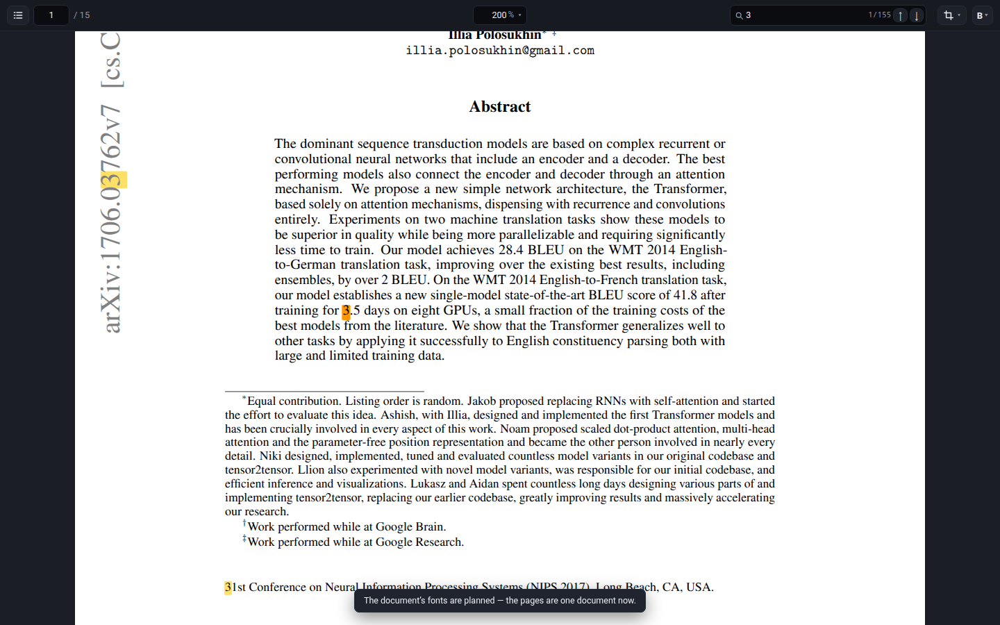

# webpdf

Render PDF pages to SVG where **the text is real text** — selectable, searchable,
hintable, and tiny — instead of thousands of glyph outlines.

```ts
import { createViewer } from 'webpdf';

const viewer = await createViewer({ container: '#viewer', source: file });
viewer.setZoom('fit-width');
```



---

## The problem

MuPDF can already emit SVG two ways, and neither is what a document viewer wants:

| mode | output | problem |
| --- | --- | --- |
| `text=text` | `<text font-family="…">` with the characters | only correct if the *browser* has that font. It almost never does: PDFs embed subsets, and a browser cannot use a Type 1 (PFB/PFA) font at all. Get it wrong and the page reflows into the wrong typeface. |
| `text=path` | `<use>` per glyph, referencing outlines in `<defs>` | always correct, but a single page becomes ~400 KB of paths with no selectable text. |

The previous project solved this by bundling a fixed set of fonts and patching
MuPDF to emit text only for those. That does not generalise: every LaTeX paper
embeds a different subset, and `/FontFile`-style Type 1 fonts — which pdfTeX
emits constantly — are not usable as web fonts in the first place.

## The approach

**Render outlines, then upgrade them back to text.** One pass produces a
guaranteed-correct baseline; a second pass replaces exactly the glyphs we can
prove we have a font for.

```
PDF page
   │
   │  MuPDF SVG writer, text=path  ───────────►  outline SVG   (always correct)
   │
   ├─ <path id="font_1_53" d="M.38 .6C…"/>        outlines, in em units, y-up
   └─ <use data-text="P" href="#font_1_53"
           transform="matrix(11.9 0 0 -11.9 124.6 81.9)"/>
                                                  ↑ MuPDF hands us the character
   │
   │  per font: build a web font
   │    outlines → OpenType/CFF charstrings → WOFF → @font-face
   │
   │  rewrite: <use> runs ─────────────────────►  <text> runs
   │
   ▼
SVG with real text, plus outlines kept for whatever could not be converted
```

### Why this works

* **No font parsing.** The PDF's embedded font program is never touched. MuPDF
  (through FreeType) has already resolved every font — embedded CFF, raw Type 1
  PFB/PFA, TrueType, substituted base-14 faces, CJK — into normalised outlines.
  Those outlines go into the generated font *as they are*: opentype.js writes a
  `CFF ` table, whose charstrings are cubic like MuPDF's, so there is no
  approximation step at all and the browser draws the same curve MuPDF would
  have drawn as a path — to the 1/1000 em grid the coordinates are rounded onto.
  Measured over the 40 most curved glyphs of a page of *Attention Is All You
  Need*, the worst moves **1.5/1000 em** (0.02 px at 12 pt); the verification suite
  reproduces **100.00% of the reference ink**, within a one-pixel
  neighbourhood.
* **Type 1 is not a special case.** A PFB is simply a font whose outlines MuPDF
  read for us. The LaTeX paper the tests render embeds five `/FontFile` Type 1
  fonts and converts all of them - as does the pdfTeX paper the demo opens from
  arXiv.
* **Positioning comes from MuPDF.** MuPDF writes one `x` (and `y`) value per
  character, so the browser never has to agree with us about advances, kerning
  or shaping. The transform maths is exact:

  ```
  <use transform="matrix(a b c d e f)">          outlines are y-up, em units
  <text transform="matrix(A B C D 0 0)" font-size="K">   text space is y-down

  K = sqrt(|ad − bc|)   A = a/K   B = b/K   C = −c/K   D = −d/K
  (x, y) = [A C; B D]⁻¹ (e, f)                   per-character baseline origin
  ```

### Character mapping

Each glyph is reachable under a real Unicode value where MuPDF recorded one
(`data-text`), so copy, search and screen readers work. A ligature is the case
that needs help: the outline device names a glyph by the *first* of the letters
it was shown with — the one glyph a typesetter drew for `fi` arrives as `f` — and
a document whose own encoding is honest about it names the glyph `U+FB01`
instead. Both are the same claim written two ways, and neither says *which* two
letters the glyph is made of: only the text device knows, because it takes the
ligature apart and reports one character per letter (`core/svg/ligatures.ts`).

So the text carries the **letters** — `first` stays `first`, which is what a
reader searches for, selects and copies, and what an extractor or a screen reader
gets — and the glyph is still the one the page drew, because the face is built
with a `liga` rule (`core/font/build.ts`): asked for `fi`, the shaper finds
`f`+`i` → the ligature glyph. A glyph written as several characters is emitted in
a `<tspan>` of its own with one position rather than a position per character,
because a browser only joins letters it lays out together — measured: the same
face with `x="0 300"` draws `f` then `i`, with `x="0"` it draws the ligature.
`tests/browser/ligature.mjs` renders a real document's ligature both ways and
holds the two rasters to the same pixels (0 differing of ~19000 on each of the
corpus's three font containers), and `tests/font-plan.test.ts` holds every
planned face to laying the letters out as the page's one glyph.

Only what is left over falls back to a code point from the BMP Private Use Area
(`U+E000…U+F8FF`): a ligature whose letters could not be established, or whose
face has no glyph for one of them, a glyph drawn two different ways on one page,
or one the text device did not describe. Every case produces a `cmap` entry
pointing at the right outline, so nothing renders blank.

### Falling back

Anything not provably safe stays an outline, glyph by glyph:

| situation | behaviour |
| --- | --- |
| Type 3 font, bitmap-only glyph | `<use>` outline kept (MuPDF emits a `<g>`) |
| glyph with no outline in `<defs>` | `<use>` outline kept |
| stroked text (`stroke` attribute) | `<use>` outline kept |
| right-to-left or complex-shaping scripts | `<use>` outline kept (see limitations) |
| ligature whose letters cannot be established | the code point the page gave it (see limitations) |
| more than 6400 unicode-less glyphs in one font | the excess stays outlines |
| `textMode: 'paths'` | the whole page stays outlines |

There is no configuration in which the output is *wrong*; the worst case is the
older, larger, still-correct representation.

---

## Results

Measured on page 1 of the papers in the test corpus, all of them downloaded from
their public URLs (`demo/papers.mjs`):

| document | outline SVG | with real text | glyphs as text | fonts (WOFF) |
| --- | --- | --- | --- | --- |
| *Attention Is All You Need*, 1 page (6 Type 1/PFB fonts) | 373 KB | 74 KB (**20%**) | 2464 / 2464 | 6 (20 KB) |
| *Deep Residual Learning*, 1 page (9 fonts, bitmap figures) | 579 KB | 117 KB (**20%**) | 3630 / 3630 | 9 (33 KB) |
| *GPT-4 Technical Report*, 1 page (6 fonts) | 398 KB | 89 KB (**22%**) | 2917 / 2917 | 6 (18 KB) |

The same paper over 3 pages: 1260 KB of outlines become 458 KB (36%) across 18
distinct faces, 51 KB of WOFF.

Those numbers are the default output, link hit areas included — that is what the
extra 1–7 KB buys: one anchor and one transparent rectangle per link annotation
(37 on the *Deep Residual Learning* page, 8 on the *GPT-4* page, 33 across the
first three pages of *Attention Is All You Need*, and none at all on its title
page). `links: false` drops them again.

Ink coverage of the text render against MuPDF's own outline render: **100.000%**,
on page 1 of each paper and on pages 2, 3 and 7 of *Attention Is All You Need*
(the pages with the most glyphs, and the one page that keeps a glyph as an
outline). Coverage is the strict measure — every pixel of reference ink has text
ink on it — and the residue the other way is antialiasing and stem darkening:
the text render carries 0.1–0.9% *more* ink than the reference, around the same
curves. Those curves are the same curve: round-tripped through the font and
measured glyph by glyph, the worst of a page's 40 most curved outlines is
**1.5/1000 of an em** from the cubic MuPDF drew (0.02 px at 12 pt), which is the
1/1000 em grid the coordinates are rounded onto.

---

## Usage

### A viewer

```ts
import { createViewer } from 'webpdf';

const viewer = await createViewer({
  container: document.querySelector('#viewer')!,
  source: fileOrUrlOrArrayBuffer,
  zoom: 'fit-width',
  shadowDom: true,
  onEvent: (e) => { if (e.type === 'page-change') console.log(e.page); },
});

viewer.goToPage(12);
viewer.setZoom(2);
viewer.destroy();
```

`viewer.save()` writes the open document out again — the same document, in
MuPDF's copy of it, compressed and with any encryption taken off:

```ts
const bytes = await viewer.save();   // a Blob, a download, a printer
```

That is not the file the document was opened from — whoever handed the viewer its
bytes gets *those* back from a save, byte for byte, which is their business rather
than the viewer's — so `save()` is for handing the document on: to a download, to
another tool, or to a printer. It is what Ctrl+P in the demo is built on, and what
makes printing work for a document that had to be unlocked: the file still carries
the password, and whatever is handed a PDF to print does not have it.

Only the pages near the viewport are ever in the DOM. Everyone else is an
absolutely positioned box whose geometry was computed up front, so zooming
restyles boxes and never re-renders a page.

The window is deliberately wider than the viewport, and *rendering* a page is
deliberately separated from *putting it in the document*:

```ts
createViewer({
  container,
  keepPages: 1,           // pages either side of the viewport that stay in the DOM
  overscanViewports: 1,   // how far past the viewport the rendered window reaches
  prepareAhead: 3,        // pages past the window rendered while nothing else is happening
  renderMode: 'frames',   // how a page is drawn while the document's fonts are planned
  planFonts: true,        // plan one face per font for the whole document, in the background
});
```

* A page is rendered about a viewport before it can be read, so arriving at it is
  not the moment its render starts.
* **The document's fonts are planned in the background, and the pages become one
  document when the plan is ready.** The engine walks the document once, text
  only, drawing nothing, and builds one `@font-face` per *font* rather than one
  per page (`EngineOptions.planFonts`). Nothing waits for that walk: until it is
  done each page is drawn with the faces *that page* drew, in a frame of its own,
  where registering them cannot touch another page; the moment it is done, the
  viewer writes every planned face into its own document in one go and replaces
  the frames with it. `renderMode` is exactly that story (`'progressive'`), a
  frame per page for good (`'frames'`), or one document with nothing drawn until
  the plan is ready (`'global'`). The demo starts in `'frames'` and offers all
  three on the card; the library's own default is `'progressive'`.
* A finished page is installed at a **quiet moment** — 150 ms after the view has
  stopped moving — unless the reader is looking at it or is one page away from
  it, in which case it goes in straight away.
* While the reader is at rest, the pages just past the window are rendered *and*
  installed: the SVG is parsed and laid out off-screen, so reaching one costs a
  scroll and nothing else.

What a page costs, once the fonts are settled:

| what | why it costs | measured |
|---|---|---|
| parsing 100-300 kB of SVG | the page is text-heavy and every element is a positioned `<tspan>` | 4-7 ms |
| the plan's walk | the page through MuPDF's display list plus its text device, before the page is drawn | 4-22 ms |
| building a face | one embedded program compiled into one web font, per *font* and not per page | 25-40 ms |

The cost that is *not* in that table is the one this design exists to avoid.
Registering a `@font-face` is not a local change: Blink's font-update
invalidation walks the whole document (`MarkSubtreeNeedsStyleRecalcForFontUpdates`
from the document element down, with no display-lock or containment check), so a
face added to a document that already holds a paper re-lays-out every text run in
it. Measured on a 15-page paper with Chromium's own paint-invalidation tracking:
**112.9 ms and 3347 "fonts changed" nodes for one face**. Nothing short of a
separate document contains that — shadow roots do not help, because Chromium
*drops* an `@font-face` declared inside a shadow tree instead of scoping it, and
`content-visibility` only defers the work to the moment the page is revealed.

Before the plan existed, a page was drawn in a same-origin frame of its own, so
that the face it brought could only invalidate that frame (measured: 0 nodes in
the viewer's document, 450 in the pages' own). Those are the two answers, and the
viewer now uses both: a **frame per page**, with that page's own faces, while the
document's plan is being walked; then **one planned document**, where every face
is registered in one write and none after it, so the pages are one document and
the browser's own text behaviour - selection across a page boundary,
find-in-page, a caret - is the reader's. The frames are not free (a document, an
iframe, 675 nodes and ~0.18 MB per page, measured), which is why they are the
interim rather than the destination, and why a host that wants one document from
the first pixel asks for `renderMode: 'global'` and sees nothing until the plan
is ready.

That is measured, not asserted. `tests/browser/modes.mjs` holds all three modes
to it: in the frame mode the viewer's own document is told about **no face at
all** while pages arrive, and the faces a page brings leave every page already on
screen exactly as it was - the same face count in every frame, before and after;
in the progressive mode the first page is on screen *before* the plan is ready
and the switch then draws it again under the document's faces; in the global mode
no frame ever exists. `tests/browser/single.mjs` counts the faces after the
switch and finds **33, and 33 again after reading the document from end to end**,
with no iframe anywhere in the viewer. The same count on the demo, page by page
to the end of the paper, is 33 → 33 planned and 48 → 89 with `planFonts: false`;
every one of those 41 later registrations is a whole-document re-layout while the
reader is reading. `tests/font-plan.test.ts` holds a planned page to the per-page
render character for character, and every character to the glyph the page drew.
What the document says is the page's own text and not a rendering of it: a word
set with a ligature copies as its letters, and `tests/browser/single.mjs` copies
a selection that spans two pages and refuses any character the page never wrote.

Planning is not free, and it is not free of the reader either — which is the
whole reason it runs behind the frames. `open` costs the document read and
nothing else; the plan is then walked and built in the background while pages are
drawn a frame at a time, and the document becomes one document when it is ready:

| document | pages | open | plan ready after | faces | bytes |
|---|---|---|---|---|---|
| *Attention* | 15 | 0.20 s | 0.73 s | 33 | 94 kB |
| *ResNet* | 12 | 0.13 s | 0.54 s | 28 | 83 kB |
| *GPT-4* | 100 | 0.05 s | 2.32 s | 77 | 249 kB |
| specification | 756 | 0.11 s | 18.30 s | 48 | 216 kB |

(`node tests/font-plan-cost.mjs`; `tests/font-plan.test.ts` prints the first row
from inside the engine, where the document has been read once already: *Attention*
opens in **58 ms with the plan not ready**, and its plan is ready 428 ms later.) Planning the document *whole* is what keeps
the face count small, and the background is what keeps it out of the way. The
alternative — a face per page's glyph set, which is what
`EngineOptions.planFonts: false` does and what the demo's `IFrame + Per Page
Font` selects — mints **89 families over *Attention*'s 15 pages** against the
plan's 26, and 88 over *ResNet*'s 12 against 27, because a page's font is a
subset of the glyphs that page happened to draw (`tests/font-plan.test.ts`), and
every one of those extra families is registered into the document while the
reader is reading it.

#### Cropping pages to their content

```ts
import { CROP_RULES, type CropRuleId } from 'webpdf';

viewer.setCrop(['arxiv', 'page-number']);       // trim to content, minus those marks
viewer.setCrop(['arxiv', 'page-number'], 8);    // ...keeping 8pt of margin around it
viewer.setCrop(null);                           // show the pages whole again
viewer.cropBox(1);                              // { x, y, width, height } | null
```

The rules are [PaperCutter](https://github.com/zzysonny/PaperCutter)'s: a page is
reduced to the bounding box of its text and its larger drawings, with the spans
that match an enabled rule left out of that box. A rule is a test on one text run
- `s.startsWith("arXiv:")`, `s.lstrip().rstrip().isdigit()`, `re.match("CHAPTER
[0-9]\.", s)` - and `CROP_RULES` publishes them with the source line each came
from, so a host can render its own control from the same table the engine uses.
`renderDocument(source, { crop, cropPadding })` does the same thing headlessly,
which is the batch case the original script exists for.

The margin is in page units - 1/72 inch - and is stopped by the page's own edges.
It costs nothing to change: the rules decide where the content is, the margin is
added to that box at render time, so the field in the demo re-lays-out the pages
without reading a single one of them again. Zero is the library's default, which
is exactly what the reference script crops to; the demo's own field starts at 6pt
- a twelfth of an inch, which is enough that a trimmed page does not look cut
off.

Two properties are worth stating plainly, because they are the difference between
this and "delete what is outside the box":

* **The crop is a `viewBox`.** Every element the page had is still in the SVG -
  the text is still there to be selected and searched, and the link hit areas are
  still where they were. The reader sees a smaller window onto the same drawing,
  which is exactly what a PDF crop box is. (The page's *layout* size follows the
  crop, so the scroll height is right.)
* **A rule may not slice a line of text.** The box is the union of whole text
  runs, measured from all four corners of each glyph's quad, so a mark is either
  inside the window or outside it - never half in. A run measured from a single
  corner collapses to a line and takes the bottom line of the page with it; that
  is a bug this code had, and `tests/crop.test.ts` and the demo test both pin it.

Measuring a page costs a few milliseconds, and the scroll layout cannot be built
until the boxes are known, so `setCrop` reads the document in the background and
lets the layout follow: the reader's own page is measured first, one re-layout per
frame at most, and `crop-change` reports the progress. The reader keeps their page
and their place on it throughout. An engine keeps what it measured, so toggling a
rule off and on again is free. Internal link destinations are points on the
*uncropped* page and are translated to the crop before the jump, so a link still
lands where it says.

#### Bionic reading

```ts
viewer.setBionic(true);        // every word's first letters at full strength
viewer.setBionic(true, 0.3);   // ...with the rest of each word fainter still
viewer.bionicDim;              // 0.5: `BIONIC_DIM`, until a host says otherwise
viewer.setBionic(false);       // the document's own page again
```

Bionic reading gives every word a *fixation point* - its first letters, so the eye
has somewhere to land and the brain finishes the word on its own. Which letters is
not a guess of ours: [`text-vide`](https://github.com/Gumball12/text-vide) decides
it from the word's length, and the engine holds exactly those glyphs at the
document's own strength while everything else in the word is drawn back at a
reduced opacity (`core/svg/bionic.ts`). How far back is a setting - the
`bionicDim` render option, `0..1`, with `BIONIC_DIM` (a half) as the default and
`BIONIC_MIN_DIM` as the floor - because how much of a word to hold is a matter of
taste and of eyesight; the demo offers 30% to 70% and stars the value in force.
`renderDocument(source, { bionic: true, bionicDim: 0.4 })` does the same thing
headlessly, and an exported SVG carries it.

**Faded, not bold** - and that is the part worth reading. The fonts here are
rebuilt from the page's own outlines and have one weight, so `font-weight: bold`
is the browser's synthetic emboldening: it smears the letterforms of a text face
badly, and because every character keeps the position the PDF gave it, the
emboldened letter is drawn wider *into* the letter after it, so a fixation point
looks both blobby and cramped. An opacity costs nothing, works on text of any
colour (it is not a grey - it is the page's own ink, thinned), and leaves the
glyphs exactly as they were.

It is a text-level effect rather than a word-level one: anything `text-vide` finds
no word in - a bare number, a formula, a run of symbols - is faded like a word's
tail, so a page of prose reads as intended and a table reads as uniformly light.
Whitespace between two words is never faded: the attribute would draw no pixel.

A word is counted in *letters*, not in glyphs. `fi` is one glyph in most text
faces and two letters to a reader, and the letters are what the fixation point is
made of, so a ligature is spelled out before the words are looked for and the
marks are read back onto the glyphs afterwards. A glyph the fixation point
reaches into is marked whole - it is a single outline and cannot be drawn half
dark - which is why `find` marks `fin` and not the `n` alone.

It changes how the text is **drawn** and nothing else. A character carries its
own x and y — the letters of a ligature are the one exception, because the shaper
has to lay them out together, so they share the `<tspan>` that starts at the
glyph's own position — and the fade is an attribute of the character's own
`<tspan>`: the words do not reflow, the pages do not change size, and nothing has
to be measured again. Toggling it re-renders what is on screen; the text, the
selection and the position of every character are identical either way. The demo
test checks that down to the ink: the same page, the same edges, less of it dark.

#### Spaces, and why a copy works

An outline SVG has no spaces in it. MuPDF draws a glyph by referencing its
outline, and a space has no outline to reference, so it draws nothing at all -
and what comes out is `Providedproperattributionisprovided`. That is what a
reader copies, and bionic reading can find no word boundary in it either.

So the spaces are written back (`src/core/svg/spaces.ts`). The text device
reports every character it read, spaces included, with the origin it starts at;
a space has no ink, so putting the character back cannot change what the page
looks like. Two details are what make it exact rather than approximate:

* **A space is anchored to the character after it**, which starts where the space
  ended. The space is then written at that character's origin, so it stays inside
  the line of the glyph it belongs to - which matters, because a cropped page
  measures its lines and a box that hangs below one looks like a sliced line.
  Anchoring to a *point* rather than to a bounding box is also what keeps it
  right for rotated text.
* **A line break is a space too.** The device ends a line instead of writing a
  character, so two lines of the same run would otherwise read as one word
  (`permission toreproduce`). It is written back only where the break is what
  separates the two words: a line that already ends, or whose successor already
  starts, with a space is separated once.

A space the page *does* draw - some fonts give one an outline - is left to the
glyph that already carries it, and trailing whitespace has nothing to sit in
front of, so neither is written twice. The exception is a drawn space whose glyph
cannot become text: figures set in Type 3 fonts draw their spaces with a glyph
that has no outline to rebuild, and the character is then nowhere in the SVG, so
its space is written back like any other. This is on in every render, and costs
about 4 ms a page.

#### Who owns the zoom

Zoom is split by gesture, because the two gestures have completely different
cost profiles:

* **A touch pinch belongs to the browser.** It changes the page scale, which the
  compositor applies without any layout or script at all, and Chromium re-rasters
  the vector content at the new scale, so the pages stay crisp. The viewer never
  resizes or rescales anything while a pinch is in flight.
* **Ctrl+= / Ctrl+- / Ctrl+0 walk a ladder of layout zoom settings**
  (25%, 50%, 75%, 100%, 125%, 150%, 200%, 300%, 400%, fit-width, fit-page by
  default - pass `zoomSteps`, or import `DEFAULT_ZOOM_STEPS` to render the same
  list in a control of your own). The rungs are sorted by what they resolve to at
  the moment the key is pressed, because the fit modes move with the window:
  stepping up from "fit width (229%)" goes to the next *larger* level, not to a
  fixed one. These are discrete and not animated, so one re-layout per press is
  fine, and they deliberately *override* the browser's own zoom shortcuts:
  browser zoom scales the whole app, chrome included, and would put the layout
  scale out of step with what is on screen.
* **Ctrl+wheel is left to the browser** (a trackpad pinch on desktop) and does no
  layout work here.

Two consequences of letting the browser own the pinch:

* The **host element must be in the flow of the root scroller**. Panning while
  zoomed only chains into the root scroller - a nested `overflow:auto` ancestor
  traps the zoomed page inside one layout viewport. The document, not the viewer,
  is the scroller.
* Everything in the document is magnified together, so **chrome next to the
  pages is magnified too** and can pan out of view. `zoom-change` carries
  `zoomed` so a host can hide its chrome; the demo fades it with an opacity
  toggle (no layout involved) and **closes whatever was open** - the outline and
  the zoom dropdown. Closing matters as much as hiding: a panel left open still
  scrolls its own items into view when the page changes, and a magnified browser
  answers that by scrolling the *visual viewport* to reveal it, which drags the
  reader's view sideways - the pinch test measures 657 px the moment the current
  page changes, with `visualViewport.offsetLeft` snapping from 657 to 0. A host
  that keeps its panels open must scroll them by hand, as the demo's
  `scrollIntoPanel` does, and never let `scrollIntoView` walk out of the panel it
  was aimed at.

The same event carries `layoutScale`, `mode` and `pageScale`, so a zoom control
can show the level the *layout* is at without re-deriving it from the effective
zoom - the browser's page scale is not a layout zoom and is not settable from
script.

Measured in this repository's Chromium (1440x900, three real LaTeX pages, a
viewport's worth of pages rendered either side of the viewport):

| gesture | layout | layout ms | frames p50/p95 |
|---|---|---|---|
| touch pinch, page scale 1 -> 10 | 8 trivial | **0.0** | 16.7 / 16.7 |
| pinch + chained pan + virtualisation | 29 | 10 | 16.7 / 16.7 |
| browser zoom (device pixel ratio 1 -> 1.5) | 0 | **0.0** | - |
| Ctrl+= (one ladder step, re-layout) | 3 | 30-90 | - |
| scrolling across a page boundary | 0 | **0.0** | 16.7 / 17.4 |
| the previous design: JS resize of every page box per zoom step | 1/step | **~17.5/step** | 16.7 / 16.8 |

### Links

A PDF link is an invisible rectangle over the page content, so the renderer
supplies both the target and the affordance. Every link annotation becomes a
transparent, focusable `<a>` hit area inside the page's SVG, and the same links
come back as data on the rendered page:

```ts
const page = await engine.renderPage(0);
page.links;   // [{ kind: 'internal', rect, page, x, y }, { kind: 'external', rect, uri }]
```

Because the hit areas *are* part of the SVG, they scale with the page at any zoom
without anything being re-measured, they survive `exportSvg`, and a downloaded
SVG file carries its own links. They are invisible, though: a PDF's links are
invisible, an exported SVG should be the page's own pixels, and no browser boxes
an anchor either — so the pointer and the keyboard are what reveal them (hover
paints a wash over the link, focus rings it). A `javascript:` URI never becomes
an `href`: a PDF is untrusted input, and an `href` is an instruction to navigate.

In the viewer, a click (or Enter, on a focused hit area) is caught rather than
followed - the page showing the document is never replaced by what the document
links to:

```ts
createViewer({
  container: '#viewer',
  // The viewer's own chrome overlaps the pages, so jumps stop short of it.
  scrollMargin: () => document.querySelector('.topbar')!.offsetHeight,
  onEvent: (event) => {
    if (event.type !== 'link') return;
    if (event.kind === 'external' && !allowed(event.uri)) {
      openInMyOwnTab(event.uri);
      return false;             // taken over: the viewer does nothing
    }
    if (event.kind === 'internal') event.y = null;  // go to the page top instead
    // Returning anything else lets the default run, with the event as edited.
  },
});
```

* An **internal** link scrolls to the destination *point*, not just to the page:
  the destination the PDF names (its `y`, in points from the page's top-left)
  ends up at the top of the viewport, clear of `scrollMargin`. A destination
  without a point - `Fit`, `FitB`, a bare `#page=` - targets the page top
  instead. Nothing is written to the URL: a destination is not a document
  fragment, and in an embedded viewer the address bar belongs to the host.
* An **external** link opens in a new tab (`window.open(uri, '_blank',
  'noopener,noreferrer')`). The anchor keeps its own `href`, so middle-click,
  Ctrl-click and "copy link address" behave the way they do everywhere else.
* **Back undoes a jump.** Following an internal link writes two entries into the
  session history - the position being left, and the destination - so the
  browser's Back button returns to exactly where the link was clicked from, and
  Forward returns to where it went. A position is remembered as a page and a
  point inside it, not as a pixel offset, so it still lands on the same line
  after a zoom in between. The URL is never touched: the entries differ only in
  their state, and `history: false` opts out entirely for a host whose own router
  owns the history (or a viewer embedded in a single-page app, where Back should
  leave the document rather than step back inside it).
* A URI a browser will not follow - `javascript:`, `data:`, `file:`, a relative
  path - gets a hit area and a `link` event with `openable: false`, but no
  `href`. Only the host knows whether it can do something with one of those (an
  extension fetching a `file:` URL, say), so the viewer reports it and stops.

### The demo app

`npm run dev` serves the demo, which is this library plus a toolbar. The toolbar
is deliberately thin, because everything about the pages' zoom belongs to the
viewer:

* **Opening a document happens on the card, not on the bar.** With no document
  open there is nothing for the bar to hold, so it is not there: the empty card
  offers the file picker and a dropdown of the example papers. Every example is a
  public URL - the first is *Attention Is All You Need* on arXiv, a pdfTeX paper
  whose Type 1 fonts are exactly the case this library exists for - so a published
  page carries no PDFs at all: the browser downloads one from whoever hosts it
  (arXiv serves it with `access-control-allow-origin: *`, so no proxy of ours sits
  in the middle) and opens it like any other file. On a local dev or preview
  server the papers the tests have cached are *also* offered, from
  `/pdf/<name>`; a build has no cache behind it, so the published site lists the
  public URLs and nothing else. Once a document is open the card is gone, and
  another file arrives by drag and drop over the pages or by Ctrl+O - the bar
  itself never carries a way to open one.
* **The rendering mode is chosen on the card too, and remembered.** It sits on
  the same line as the file picker and the examples, because it is a property of
  the session rather than of a document: the engine and the viewer are built once,
  for the mode in force when the first document is opened. *IFrame + Per Page
  Font* draws every page in its own frame with its own fonts and plans nothing;
  *IFrame → Global Font* does that until the document's fonts are planned and then
  replaces the frames with one document; *Global Font Only* shows nothing until
  they are planned. The first is starred - a star is a recommendation and not a
  state, the same as the crop menu's - and the row in force is the one the menu
  opens on and colours. The choice is written down with the document it was made
  for, like every other setting, so the next visit starts the way this one was set
  up; `?mode=` names one for a test, and `?plan=0` (the name this page used before
  there was a menu) still means the frame mode.
* **One bar, one line, no status bar.** The bar is the document's chrome and it
  arrives with the first page; it stays a single row at every window width, and
  what gives way to keep it there is the find box: below 560px the page count and
  the match count go, and below 460px the magnifier and the two match arrows go
  with them - a query nobody can see is worse than a control without an icon, and
  Enter still steps the matches. The rest of the controls are marks rather than
  words, and keep the size they were drawn at. Messages float in a toast instead
  of a status bar, and the last render's cost is not shown at all, so the pages
  own every pixel below the bar and there is no chrome pretending to stay put
  while the browser magnifies the document.
* **The tab names the document**: its own title if it declares one, else the
  file's name, else the URL it came from with the scheme taken off
  (`arxiv.org/pdf/1706.03762v7`). The page carries an icon - a page whose lines
  are held at the front and faded behind, which is the effect this reader is
  built around - as an SVG with a PNG beside it for the crawlers that will not
  take one.
* **The zoom box holds a bare number.** `%` is the control's unit and nobody types
  it; the levels - including the fit modes, listed as the percentage they resolve
  to (`229% (fit width)`) - live in the dropdown, which is the only zoom control
  on the bar, and Ctrl +/- steps that same ladder with the box left free for
  typing `150` or `1.5`. A document opens one rung *below* fit-width (200% at the
  sizes above): fit-width is the widest level that still shows the page in full,
  and starting there leaves the paper touching both edges of the window. Ctrl+0
  still means fit width.
* **The outline floats** over the pages rather than taking a column. A column
  would change the viewer's width every time it opened, and a fit-width layout
  would re-fit - visibly re-zooming the document - for a navigation panel. It
  starts closed - the pages are what the page is for - marks the entry for the
  page a document opens on, follows the current page by scrolling its own list
  and nothing else, and is put away the moment the reader scrolls the pages or
  the browser magnifies them, when there is nothing on screen to read.
* **Search behaves like the browser's find bar.** Typing boxes every match on the
  pages in front of you and jumps straight to the first one - no Enter needed -
  while the background index fills in from page one, so the count and the boxes
  settle as the rest of the document is read. `Enter` / `Shift+Enter` (and the
  arrows) walk the matches from there, `Esc` clears them. The viewer only keeps
  the pages near the viewport, so any page that is not on screen is rendered once
  and kept as text. A hit is painted as a `<rect>` measured from a `Range` over
  the matched characters and mapped back through the page's own matrix, so it
  lands on the word - and the page's markup is never restyled.
* **Search ignores whitespace on both sides.** The pages do carry real spaces
  (`Attention Is All You Need`), but a match has to survive a line break, which is
  where the browser's own find bar gives up: both the page and the query are
  lower-cased with the whitespace removed, so `encoder and decoder` finds the two
  words across a line and `AttentionIsAllYouNeed` finds them without the spaces.
  The offsets are mapped back for the boxes, so the highlight still lands on the
  characters that matched.
* **Cropping is opt-in, and never edits the page.** The *Crop* dropdown, after the
  search box, lists the marks PaperCutter removes from a page before it measures
  what is left: the arXiv stamp, a publisher's header, a bare page number, a
  numbered heading, `PRIME AI paper`, and the document's own running title. The
  **Page number** row is starred - it is the mark nearly every paper needs - but
  a star is a recommendation and not a state: the pages are shown whole until a
  rule is switched on, and nothing is ever cropped on the document's behalf. One
  bulk button is offered at a time, and it says what is left to do: *Enable all*
  (what the reference script does) until every rule that applies is checked, and
  *Disable all* from there, which puts the pages back. Each row carries the test
  it runs, so what a rule removes is never a guess. A **Padding** field above the
  list keeps a margin around what is left, in points, from 0 (the reference
  script's own crop) to two inches; it starts at 6pt, which is a hair of white
  between the ink and the edge rather than a box drawn on it.
* **Bionic reading is a dropdown, after the crop control, and it is one choice.**
  `B` opens a menu of values: *Off*, or a fade at 30% to 70% of the document's own
  strength. Choosing one turns the mode on with the faded part of every word at
  that opacity, and the value in force carries a star, so the menu opens on the
  setting the reader settled on. Nothing is emboldened: each word's remainder is
  drawn at that one opacity, which the demo test checks along with every character
  in every run keeping the exact position it had. The two modes on the bar light
  up the same way - an accent background while they are changing how a page is
  drawn - and neither counts anything on its face.
* **Links are the viewer's, and the demo just says what happened.** Clicking an
  external link opens it in a new tab and the toast names the URI; a link a
  browser cannot follow (the *GPT-4 Technical Report* links to a local file) gets
  the same click, no navigation, and a toast that says so. Back - the browser's
  own button, there is no chrome for it - returns to the position a link was
  clicked from. The demo does not take a link over: `onEvent` returning `false`
  is the hook for a host that wants to.
* **Ctrl+S and Ctrl+P mean the document, not this page.** Both keys are
  overridden, because the browser's own answers to them are about the HTML that
  happens to be drawing the document: Ctrl+S would save the page, and Ctrl+P
  would print it — SVG the viewer built, laid out again at the paper's width, with
  none of the document's own idea of a page in it. Saving writes the document's
  own bytes, under the name it is known by: the reader's file, the one a host
  handed over, or the one the page fetched because it was given a URL. Printing
  hands those same bytes to a frame of their own — a PDF is what a printer wants,
  and the browser prints one natively and exactly — so the page's SVG, its chrome
  and its scrolling are not part of the job. What is printed is the document as it
  is: cropping, bionic reading and the zoom level belong to the screen and are not
  things a printer can be asked for. An *encrypted* document is the one case where
  the bytes on hand are not what is printed: they still carry the password, and
  the browser's own PDF viewer — the thing a printer is handed — would ask for it
  in a frame nobody can see, so what goes to the printer is the copy MuPDF writes
  out, with the encryption taken off (`viewer.save()`).

### Offline, and where the engine comes from

The published site is a web app in the installable sense: a manifest, an icon at
two sizes, and a service worker that precaches the page and everything it is made
of. A reader who has opened it once can open it again with no network at all —
the page comes up, and so does the document they were reading.

Three things are cached, and they are cached differently on purpose:

* **The shell** — the page, its scripts, its styles, the manifest — is precached
  when the worker installs, into a cache named after a digest of those files. A
  redeploy is a new name, so the old copy is dropped whole on activation and
  nothing from two builds is ever served together. There is deliberately no
  `skipWaiting`: a new build takes over when the pages of the old one are closed.
  This page fetches parts of itself lazily — the engine's own chunk, when the
  first document is opened — and a worker that swapped the shell out from under a
  page mid-session would be answering those fetches with a build that no longer
  has them. So an update waits for the next visit, and a reader reading is never
  interrupted by one.
* **The engine** — MuPDF's 10 MB wasm — is *not* precached. Ten megabytes
  downloaded on install, for a reader who may never open a document, is not a
  promise a site should make. It is kept the first time it is actually fetched —
  from whichever of the addresses below answered, verified against the digest the
  build was compiled with — and served from there afterwards.
* **Documents** are the page's decision rather than the worker's: the page keeps
  the ones it has opened (the last eight, by URL) in a cache of its own, and the
  worker only looks there before going to the network. A PDF at a URL is
  immutable, so a cached one is never revalidated; something that was not kept,
  opened while offline, says so rather than failing with "Failed to fetch".

The published engine is asked for from `https://cdn.jsdelivr.net/npm/mupdf@<version>/…`
first and from the site's own copy of the same bytes second. The reason is not
speed but *time*: the CDN's URL is pinned to the MuPDF version, so it does not
change when this viewer does. An update ships new JavaScript, new styles and a
new service worker, and the browser keeps the ten megabytes it already has. (The
site's own copy is named after the version for the same reason — GitHub Pages
hands every asset a ten-minute lifetime, so a copy under a content hash would be
revalidated on every visit and a copy under the version is at least honest about
being immutable.)

A page served from the machine it is running on asks for the copy on that machine
first, and keeps the CDN second — the dev server, `vite preview`, and every test
browser do this (`engineSources` in `demo/main.ts`). The package is already on the
disk, and a test browser starts with an empty profile every launch: ten megabytes
fetched per run, to prove what the disk can answer without a network at all, is a
cost with nothing on the other side of it.

Which of the two is used is checked rather than assumed: the build writes the
sha384 of the wasm it was compiled against into the page, and bytes that do not
match are not installed — the next source is tried instead. That is what makes
the CDN a delivery channel rather than a dependency: with no CDN, or the wrong
CDN, or no network, the viewer comes up from the copy the site serves itself.
`$WEBPDF_ENGINE_CDN` replaces the address before a build (an empty value drops
the CDN entirely).

A reader who never opens a document pays for none of it: the engine is imported
when the first page is about to be drawn, not when the page boots.

### Headless rendering

```ts
import { PdfEngine, renderDocument } from 'webpdf';

// one page at a time, no DOM
const engine = new PdfEngine();
await engine.open(bytes);
const page = await engine.renderPage(0, { embedFonts: true, responsive: false });
console.log(page.svg, page.stats);
await engine.save();          // the document written out again, unencrypted

// or stream a whole document to standalone SVG files
for await (const page of renderDocument(bytes, { embedFonts: true })) {
  writeFileSync(`page-${page.index}.svg`, page.svg);
}
```

`crop: ['arxiv', 'page-number']` trims each page to its content as it is
exported, changing only the root `viewBox` - the file still contains the whole
page, the way a PDF with a crop box does. `bionic: true` fades the words' tails on
the way out, and the spaces are written back either way.

`embedFonts: true` puts the `@font-face` rules inside the SVG, which is what
makes an exported file self-contained — required for ``, for a
downloaded file, or for a CSS background.

Link hit areas are included by default, so the exported SVG is clickable where
it is opened as a document; `links: false` leaves them out, and `page.links` is
data either way.

## The browser extension

`ext/` is a Chrome extension that opens PDFs in this viewer. It is deliberately
thin: it notices a document being opened, fetches it, and gives the tab to the
viewer. There is no welcome page, no document list, no "open a file" button and no
sample paper on it, because a document arrives the way it always did — clicked,
typed, dropped or opened from the file manager.

What it is not is a second application around the viewer. The reader's position,
their settings, the keyboard and the password prompt are the *viewer's* — see
[the bridge](#the-bridge-what-crosses-and-what-does-not) — so the extension has
nothing to keep in step with it: it reads the document and hands over the bytes,
and that is all it does.

```sh
npm run build:extension        # → dist/ext/webpdf/, with a .zip and a .crx beside it
```

It draws documents with the *published* viewer — the site this repository
publishes to GitHub Pages — framed by the extension page and cached by the
browser. So the extension is 34 KB, and a fix to the viewer arrives with the next
deploy rather than with the next `.crx`. The price is that the viewer has to be
fetched once per cache window; `viewer.json`, written by the build, is the one
line that says where it is, and `--remote URL` points it somewhere else (which is
what the browser test does, so that what it exercises is the published
arrangement and not the published network).

Install it by loading `dist/ext/webpdf` as an unpacked extension
(`chrome://extensions` → *Developer mode* → *Load unpacked*), or install the
`.crx` the build writes beside it. Chrome refuses off-store CRX installs on
Windows and macOS; on Linux, developer mode plus a drag onto `chrome://extensions`
is enough. The build prints the extension id it produced, which is what
`chrome-extension://<id>/…` URLs need. The id is what the browser files the
extension's *own* two values under — the handover token and the last document its
button offers — and not the reader's positions, which belong to the viewer's
origin; keeping the key (`ext/key.pem`, gitignored and made on the first build;
`--key FILE`; `$WEBPDF_EXT_KEY`) keeps those two across builds. CI passes the
secret if it is set, and prints the id it made when it is not.

Two tests keep the `.crx` honest: `tests/extension.test.ts` checks the CRX3 layout
and that the signature covers the archive it was built from, and the last part of
`tests/browser/extension.mjs` packs the same directory with Chromium's own
`--pack-extension` and verifies *that* file with the reader this repository
writes — which is only possible if the layout, the signature context and the
signing scheme are Chrome's.

### What it intercepts, and what it does not

Three mechanisms, in order of how early they act:

* **a redirect rule, stored in the profile.** A `.pdf` path is rewritten to the
  viewer before a single byte of the document is requested — so a 50 MB paper is
  fetched once, by the extension, instead of once by Chrome and then again by the
  viewer. The rule is *dynamic* rather than a session rule on purpose: Chrome
  stops an idle service worker, and the events that would wake it are not always
  delivered, so a rule that lives in the worker is a rule that is missing exactly
  when it is first needed. `tests/browser/extension.mjs` stops the worker and
  opens a PDF to check that it does not matter.
* **the content type.** `arxiv.org/pdf/1706.03762v7` has no extension to match, so
  a response that *is* `application/pdf` takes the tab over as soon as the headers
  are in. A response meant to be saved (`Content-Disposition: attachment`) is left
  alone — that is a download, not a document to read.
* **the commit watch.** Anything that still committed as a PDF URL (a `file://`
  document, a rule the browser would not take) is taken over a moment later, which
  is the difference between "opens in webPDF" and "opens in Chrome's viewer".

The gaps, honestly: a PDF opened in the second between installing the extension
and the worker's first start (the rule is written then) lands in Chrome's viewer,
and reloading it works; a link with a `download` attribute is opened rather than
saved, so Ctrl+S in the viewer — which writes the document it is holding, under
its own name, and prints the same bytes on Ctrl+P — is the way to save one; and a
PDF inside another extension's sandboxed viewer is not a navigation this extension
can see.

### The memory

One entry per document, and it is the reader's own: where they were (a page, and a
point on it in the document's units), the zoom (a level, and whether it was a fit
mode), the crop rules and padding, the bionic fade, and whether the outline was
open. Nothing else — no bytes, no text, no titles, no history of what was read.

**It belongs to the viewer, not to the extension.** A position in page units and a
set of viewer settings are the viewer's own concepts, so `demo/memory.ts` keeps
them, in the page's `localStorage`, under one key. The consequences are worth
spelling out:

* the same memory serves every way of opening the page — the extension, a link to
  the published demo, a tab restored from the last session — because there is one
  copy of it and it is the page's;
* the extension stores none of it: uninstall the extension and the positions are
  still there, install it and they are already known;
* it is the *origin's* memory, so it is as durable as any site data: clearing
  site data for the viewer's origin forgets it, and a private window starts empty.

* A document is identified by its URL, minus the fragment (Chrome uses that for
  its own page number and it never reaches a server), or by name and size for a
  file that has no URL.
* Its position is in *page units*, so it survives a zoom, a resize and a
  different screen; the crop is accounted for, so a position means the same thing
  cropped and uncropped, and a crop arriving under the reader no longer moves
  them (they stay on the sentence, the page gets shorter around it).
* The store is the recency order: it holds the last hundred documents and the
  oldest falls off the end (`tests/memory.test.ts`, in Node).
* A document that has never been read opens at its first page with the settings
  of the last one. The *position* is deliberately not inherited.
* Settings this version does not recognise are kept rather than dropped, so a
  cached older copy of the page cannot throw away what a newer one wrote.

The viewer's `place()` is what makes this exact — the page and the point in the
document's own coordinates, which is also what `goToDestination(page, y)` takes.
It is deliberately not the browser's `scrollY`:

```ts
const viewer = await createViewer({ container: '#view', source: file });
// What the demo's memory keeps, and what it puts back:
const where = viewer.place();                  // { page: 7, y: 231.5 }
viewer.goToDestination(where.page, where.y);
```

### The bridge: what crosses, and what does not

The extension and the viewer are two documents on two origins, so the whole of
their relationship is one small `postMessage` protocol — two kinds each way, and
every one of them is something only the other side can do:

| the viewer says | the extension says |
|---|---|
| `hello` — it is up, and which bridge revision it speaks | `ready` — it is up, and which revision it speaks |
| `opened` — a document is on screen, and what to call it | `open` — here are the bytes, and what they are |
| `error` — it could not be opened | |

That is deliberately the whole list: two messages each way, and two of the four
are the version handshake. Handing over a document is the extension's — it has the
bytes, and the page never fetches one it was not given — and *what opened* is the
page's, told to the extension so that it can name the tab and offer the document
again from its toolbar button. Everything else is the page's own:

* the position, the settings and the hundred-document memory (`demo/memory.ts`);
* the keyboard — the extension focuses the frame and then has no keys of its own,
  so Ctrl+F, Ctrl+O, Ctrl+0/±, Ctrl+S and Ctrl+P are the viewer's own handlers;
* saving and printing — a write of the bytes the page is already holding, and the
  same bytes handed to the browser's own PDF viewer to print, which is why
  neither key writes or prints the page the document is drawn on;
* the password — a card in the page's own document. A cross-origin frame may not
  raise a `window.prompt`, but it can draw a field, and the page drawing the
  document is the right place to ask for the key to it.

Nothing in the protocol is a viewer internal: no DOM, no `window.webpdf`, no
storage. The extension holds the interception, the handover token and one URL for
its button; the deletion test for all of this is that uninstalling it loses
nothing but the interception — the positions are still there, because they were
never the extension's.

The protocol is versioned, because the two sides are updated on completely
different schedules — see [an old extension, a new viewer](#an-old-extension-a-new-viewer).

### CORS, and why the fetching happens where it does

The extension frames a page at `zzysonny.github.io`, and the document it is asked
to show is usually somewhere else entirely. A page at one origin cannot
fetch a PDF at another: CORS applies, and PDF servers overwhelmingly do not send
`Access-Control-Allow-Origin`. (GitHub Pages itself does — `curl -sI` on the
published site shows `access-control-allow-origin: *` — and so does arXiv; a
departmental web server, a publisher, a repository behind a login: no.)

So the fetch does not happen in the framed page. It happens in the extension
page, which is a `chrome-extension://` document with `<all_urls>` in
`host_permissions`, and an extension's fetches are not subject to another site's
CORS policy. The bytes are then handed to the frame as an `ArrayBuffer` over
`postMessage` — transferred, not copied — and the frame draws them. CORS therefore
does not make this extension impossible: it is the reason the extension page exists
at all. (It is also why the framed page needs nobody's permission to read the
document, and why the viewer can be served from Pages.) What the extension does
need the network for is the viewer's own code, which GitHub Pages serves with
`cache-control: max-age=600` and content-hashed asset names, so the browser keeps
it.

Three consequences worth knowing:

* **Nothing is proxied and nothing is uploaded.** The bytes go from the server to
  the tab, which is where they were going. The viewer code is the only thing the
  extension asks anyone else for.
* **A cross-site extension fetch is still cross-site.** Cookies that are
  `SameSite=Strict` may not be attached, so a PDF behind a strict-cookie login can
  answer 403 where Chrome's own viewer would have shown it. The error card says
  so, and a viewer carried inside the extension would behave the same way.
* **`file://` needs the switch.** PDFs on disk are read only when *Allow access to
  file URLs* is on for the extension in `chrome://extensions`; the extension says
  so in the error card when a local file cannot be read.

The handover is guarded by a token: the redirect the browser performs cannot know
which tab it was for, so the viewer URL carries a secret kept in the extension's
own storage, and the worker resolves a document only for a page that presents it.
A web page that frames or opens `viewer.html` therefore gets nothing back — it
cannot guess the token, and the page it framed only ever talks to its own parent.

### An old extension, a new viewer

The two halves are updated on completely different schedules: the viewer is
redeployed whenever this repository is, and the extension is updated when its
reader gets round to it. So an installed extension meeting a page that has moved
on is the ordinary case, not an accident, and the bridge is versioned so that it
stays boring.

`hello` carries `bridge` — the revision the page speaks — and `accepts`, the host
revisions it still serves; the extension answers `ready` with its own revision.
An extension from before revisions existed says nothing at all, which reads as
revision 1, the contract as it always was, and it is served like any other. Adding
a message is therefore free: it is sent only to a host whose `ready` says it knows
it. `tests/browser/bridge.mjs` is a stub host that never announces itself, driving
the real viewer end to end, and `tests/browser/extension.mjs` puts a stub *viewer*
that speaks a later revision in front of the real extension — one that still
serves revision 1, and one that does not.

A break is a bump, not a contortion. When something genuinely has to change
meaning, the old revision comes off `accepts` and stays off: the extension shows
a card saying it is out of date, and the reader installs the current build. There
is no obligation to keep serving a revision the page would only serve badly, and
no silent break either — anything a host of a served revision would not understand
is either gated on that host's revision or it is a new revision.

### Notes for any embedder

The library was written with content scripts in mind:

* **No globals.** The only optional one is a debug flag (`globalThis.__wpdfDebug`)
  and the `window.webpdf` handle the demo installs for itself.
* **Shadow DOM** (`shadowDom: true`) keeps a host page's CSS from touching the
  viewer, and vice versa.
* **The pages become one document, and until they do every page is one of its
  own.** A `@font-face` belongs to a document, and registering one makes Chromium
  lay out every text run in that document again, so the faces have to be in place
  before the pages are: the engine plans the document's fonts in the background,
  one face per font, while the viewer draws a frame per page with the faces that
  page brought. When the plan is ready the viewer writes every face in once and
  replaces the frames with its own document. Nothing registers while the reader
  scrolls, which is what makes one document possible — and with it selection
  across a page boundary, find-in-page over the whole paper, and a caret that
  behaves; a host that needs those from the first pixel asks for
  `renderMode: 'global'`. A host page's CSP
  applies to the faces exactly as it does to the viewer's own styles: they arrive
  as `data:` URLs, so a page with `default-src 'self'` needs `font-src data:` for
  text to be drawn with the document's fonts.
* **Give it the root scroller.** The viewer sets the container's height to the
  full layout height and expects the document to scroll; do not put it inside an
  `overflow:auto` wrapper, or a zoomed page cannot be panned past one viewport.
  A wheel over a page reaches that scroller because the page is not a scroller of
  its own.
* **Stylesheets are constructed** where available. Two reasons: Chromium does not
  load `@font-face` rules declared inside a shadow root, and a constructed
  stylesheet is not subject to a page's `style-src` policy.
* **Sanitised sources.** `File`, `Blob`, `ArrayBuffer`, `Uint8Array`, a URL
  string or `{ url, headers }` all work.
* **Nothing is assumed about the DOM.** The viewer mounts into whatever element
  you give it and cleans up fully in `destroy()`.
* **Rendering runs in a worker by default**, and falls back to the main thread
  automatically if a worker cannot be created or does not answer within 15 s -
  so opting in can never leave you with a viewer that does not render. Pass
  `worker: false` to force inline rendering. The prebuilt library resolves its
  worker relative to `dist/lib/webpdf.js`; if you move `assets/` somewhere else (an
  extension must often vendor it), pass `workerUrl` explicitly.
* **The engine is fetched when the first document is opened**, not when the page
  boots, and `configureEngineWasm` says where from — in order, each with the
  digest its bytes are expected to have, so a source that answers with something
  else is skipped instead of installed:

  ```ts
  configureEngineWasm({
    sources: [
      { url: `https://cdn.jsdelivr.net/npm/mupdf@${version}/dist/mupdf-wasm.wasm`, integrity },
      { url: new URL('engine/mupdf.wasm', import.meta.url).href, integrity },
    ],
  });
  ```

  Call it before the first document is opened; it is repeated to the rendering
  worker, which has its own realm. The download is reported to nobody: a host that
  wants a progress bar has its own loading state to show (the demo shows its
  progress strip while the first document opens).
* The MuPDF wasm binary is otherwise fetched relative to the module URL. If your
  extension needs to control that (for `web_accessible_resources`), set it
  explicitly before importing — a host that has already placed the module keeps
  its say, and `configureEngineWasm` only fills the gap when nobody has spoken:

  ```ts
  globalThis.$libmupdf_wasm_Module = {
    locateFile: (p: string) => chrome.runtime.getURL(`vendor/${p}`),
  };
  ```

`PdfEngine` and the two error classes are exported from the package entry
(`dist/lib/webpdf.js`, `src/index.ts`), not from `api.ts`, because exporting them
means importing the module that owns MuPDF — and a page that draws in a worker
should not build a second engine on the main thread, or fetch the wasm for it.

`PdfEngineLike` is exported, and `WorkerEngine` is the reference implementation
of it, so a different transport (an extension's offscreen document, a shared
worker, a remote renderer) only needs `open` / `renderPage` / `drainNewFonts` /
`close` - plus `measureCrop`, without which a viewer simply does not crop, and
`save`, without which a page can still write out a document it was handed the
bytes of but not one it only knows the URL of.

---

## Layout

```
src/
  index.ts                  the package entry: api.ts, plus PdfEngine (and the
                            wasm it brings) and configureEngineWasm
  api.ts                    createViewer, renderDocument, public types - and no
                            import of the engine, so importing it is free
  core/
    engine.ts               MuPDF document + page rendering (DOM-free)
    engine-wasm.ts          where the wasm comes from: sources in order, digests
                            checked, fetched when the engine is first needed
    crop.ts                 PaperCutter's rules, and the box they leave
    debug.ts                opt-in pipeline tracing
    links.ts                link annotations → data, and → SVG hit areas
    svg/
      glyphs.ts             scanner for MuPDF's SVG (outlines + <use>)
      text-upgrade.ts       <use> runs → <text> runs, with spaces and fading
      spaces.ts             where the spaces the outline device cannot draw go
      ligatures.ts          the letters behind the one glyph a font draws for two
      bionic.ts             text-vide's fixation points, and how they are drawn
      package.ts            id namespacing, root rewriting, font embedding
    font/
      svg-path.ts           SVG path data parser (M/L/H/V/C/Z + implicit repeats)
      program.ts            a glyph read out of the PDF's own font program, by id
      plan.ts               one font per font, for the whole document
      build.ts              outlines + cmap + ligatures → OpenType/CFF (opentype.js)
      woff.ts               sfnt → WOFF (zlib via CompressionStream)
      registry.ts           per-page planning, caching, @font-face rules
  worker/
    pdf.worker.ts           engine host; installs onmessage before awaiting wasm
    client.ts               WorkerEngine: a PdfEngineLike that proxies to it,
                            handing out each face once
  viewer/
    layout.ts               page geometry + visible-range maths
    viewer.ts               virtualised scrolling viewer (browser-owned pinch):
                            a window wider than the viewport, a document per
                            page, pages installed at a quiet moment, pages
                            prepared and installed ahead while the reader rests
demo/                       the demo application (the Vite root, and the site)
  index.html                the page: the bar, the panels, one viewer container,
                            and the frame a print goes into
  main.ts                   the bar, the card, and everything wired to them
  memory.ts                 where the reader was: the hundred most recent documents
  papers.mjs                the corpus: public URLs, and where they are cached
  papers-client.ts          which of them this page has a local copy of
  examples.ts               the picker's entries, cached copies first
  menu.ts                   a dropdown in the bar: open, close, arrows, Escape
  search.ts                 indexing the document, and boxing what matches
  crop.ts                   the crop dropdown: one toggle per rule
  zoom.ts                   the ladder, and what the box will accept
  panels.ts                 scrolling a panel without moving the document
  styles.css                the chrome's own stylesheet
  icon.svg, icon.png        the site icon: a page, held at the front and faded
demo/                       (continued)
  host.ts                   the host bridge: hand over a document, hear what opened
  host-mode.js              the one thing that must happen before the first paint
  offline.ts                the page's half of offline: the worker's registration,
                            and the documents kept for the next visit
  sw.js                     the service worker: the shell, the engine, the reader's
                            documents - the two lists it needs are filled in by
                            `pwa()` in `vite.demo.config.ts`
  manifest.webmanifest      the installed app: name, colours, the two icons
  engine-virtual.d.ts       what `virtual:webpdf/engine` hands the page
  vite-env.d.ts             Vite's own types (`import.meta.env.PROD`)
ext/
  manifest.json             MV3 manifest; the build adds the version and the key
  src/
    background.ts           the worker: interception, the handover token, the rule
    viewer.ts               the extension page: fetch the bytes, hand them over
    viewer.html, viewer.css the shell: one frame, a progress line, one error card
    lib/url.ts              the one question the worker asks about an address
    chrome.d.ts             the two dozen API members this extension uses, typed
tests/
  *.test.ts                 Node tests (real PDFs through the real wasm)
  extension.test.ts         which URLs the extension opens, and the crx, in Node
  memory.test.ts            the viewer's memory, in Node (no browser, no extension)
  engine-save.test.ts       writing a document out, encrypted documents included
  engine-wasm.test.ts       which wasm source is used, and what a wrong one costs
  worker-client.test.ts     what the worker engine is told, and what it hands
                            back: the clonable options, and a document's faces
  font-outline.test.ts      a glyph's curve survives the font it is written into,
                            and the asset's format label matches its bytes
  font-program.test.ts      a glyph drawn from the PDF's own font program is the
                            outline the page drew, glyph for glyph
  font-plan.test.ts         a document opens before its fonts are planned, and its
                            faces then follow its fonts and not its pages; every
                            character reaches the glyph the page drew, every
                            ligature draws its letters as the page's one glyph,
                            and a planned page draws what the per-page fonts drew
  font-plan-cost.mjs        what planning costs and saves, per corpus paper: the
                            table the viewer section quotes
  font-programs.mjs         what the corpus embeds, and what a browser takes
  pdf-cache.mjs             fetches the corpus, lists it, clears it
  browser/                  headless-Chromium verification over CDP
    demo.mjs                the built demo, driven through its own UI
    single.mjs              one document: selection, clipboard, keys, wheel, faces
    modes.mjs               frames until the plan is ready, then one document: the
                            three rendering modes, and the mode a reader keeps
    ligature.mjs            the letters and the ligature glyph are the same pixels
    pinch.mjs               the pinch/zoom contract
    bridge.mjs              the host protocol: a new page, an old host
    pwa.mjs                 the service worker, and a server killed mid-test
    extension.mjs           the extension itself, loaded into Chrome
    compare.mjs, diff.mjs   text-vs-outlines fidelity, with a difference map
scripts/
  no-jekyll.mjs             marks the Pages artifact as pre-built
  build-extension.mjs       stages the extension, zips it, packs the crx
  crx.mjs                   CRX3, written and read: the artifact Chrome installs
vite.ext.config.ts          the extension's two entry points
```

Rendering never touches the DOM, which is why the same `PdfEngine` runs inline,
inside the worker, and under Node in the tests.

## Development

Every build writes into its own directory under `dist/` — `dist/lib` for the
library, `dist/demo` for the site, `dist/ext` for the extension and its `.crx` —
so that a build which empties its output directory cannot empty anyone else's.

```sh
npm install
npm run dev          # demo on http://127.0.0.1:5173
npm run pdfs         # fetch the test corpus into the cache (also happens on demand)
npm test             # Node tests: font pipeline over the real papers
npm run test:browser # builds the demo, serves it, verifies in headless Chromium
npm run verify       # typecheck + both test suites
npm run build:lib    # the library, in dist/lib
npm run build:pages  # the published site, in dist/demo
npm run build:extension  # the extension, in dist/ext
```

The dev server serves the engine's wasm straight out of `node_modules`, and a
built page has its own copy emitted next to it, so **nothing in development
fetches the engine from the CDN**. The dev server also serves no service worker —
a worker that answers a reload out of its cache would make every edit a mystery —
and the registration is behind `import.meta.env.PROD` for that reason. What the
built site does with both is `tests/browser/pwa.mjs`.

`npm run build:extension` compiles the worker and the viewer page with Vite and
then stages, zips and signs the extension, which is small because it carries no
viewer of its own. `--remote URL` points it at a server other than github.io,
which is what the browser test uses so that what it exercises is the published
arrangement and not the published network. The
signing key comes from `--key`, from `$WEBPDF_EXT_KEY` (a path or the PEM itself)
or from `ext/key.pem`, which is gitignored and made on the first build; with none
of those, a key is made for that build alone and the extension id changes with it.
Keep one — locally or as a repository secret — if the id is meant to survive,
because the browser files a reader's remembered positions under it.

### The test corpus

No PDF is stored in this repository, and none is generated: `demo/papers.mjs`
lists the corpus - four papers, at the time of writing - by public URL, and
everything refers to that one list: the Node tests, the browser tests, and the
demo's example list on a local origin. Nothing needs a document to be checked in,
reviewed as a binary, or replaced when it goes stale; `git ls-files '*.pdf'` is
empty, and the tests cannot drift from what a reader would actually download.

The URLs are versioned arXiv papers (plus ISO 32000-1 from Adobe), chosen because
they are immutable and served with `access-control-allow-origin: *`. Both matter
here: the browser tests fetch them the way the published demo does, with no proxy.

Downloads land in a cache, `.scratch/pdfs` by default, which is gitignored. Point
it somewhere else - a shared or pre-warmed directory, a CI volume - with
`$WEBPDF_PDF_CACHE`; a relative path is read from the repository root. The tests
fetch whatever is missing on their own, so a cold cache costs one download and
every run after that is offline. `npm run pdfs -- --list` shows what is cached,
`-- --clear` empties it, and the cache directory is never written to by a build.

The browser suite is the interesting one. It renders each page twice — once as
MuPDF outlines, once through the text upgrade — rasterises both, and reports how
much of the reference ink the text render covers. It needs a Chromium binary;
set `$CHROMIUM` if it is not at `/usr/bin/chromium`. It also needs the network:
the last thing it does is open a paper at its public URL, because that is what a
reader of the published page does. The document-specific search checks run
against the cached copy of the paper, so their counts do not depend on what the
network returns today.

`tests/browser/diff.mjs` produces a red/green difference map for human eyes:
overlapping ink is yellow, so any systematic offset or missing glyph is obvious.

### Publishing

`.github/workflows/build.yml` typechecks, builds `dist/demo` and deploys it with
`actions/deploy-pages` on every push to `main` (and on demand from the Actions
tab) — and it is named for what it does rather than for where it publishes,
because publishing the site is only half of it. It deliberately does **not** run
the test suites: rendering a paper and rasterising pages is a fine thing to do on
a developer's machine and a poor gate between a commit and the published site. It
does not fetch the corpus either - the published build has no use for it.

The same job builds the extension and uploads the signed `.crx` as an artifact —
one job, because the extension frames the site that job publishes and a run that
ships a viewer with an extension that cannot draw with it is worse than a run that
ships neither. It does not create a release and does not publish to the Chrome Web
Store: the artifact is the deliverable. The typecheck above covers it too, because
the worker and the viewer page are TypeScript. Set the `WEBPDF_EXT_KEY` secret to
a PEM private key to keep the extension id — and with it every reader's remembered
positions — stable from one run to the next.

Pages has to be set to **Source: GitHub Actions** in the repository settings —
there is no `gh-pages` branch and nothing to commit back to the repository. The
site is served from the repository's own path (`…github.io/webPDF/`), which is
why the demo derives its base from the page's own URL and every asset Vite emits
is referenced relatively.

The build also writes the two files that make the site an app rather than a page
— `manifest.webmanifest` and `sw.js` — and they are written *from* the build:
the manifest names the icons by the names the bundler gave them, and the service
worker precaches the exact list of files the page is made of, under a cache named
after their digest (see `pwa()` in `vite.demo.config.ts`). Nothing has to be kept
in step by hand, and nothing about the deploy changes: `upload-pages-artifact`
uploads `dist/demo`, manifest and worker included.

The one address in the published site that is not the site's own is the engine's
CDN (see “Offline, and where the engine comes from”); set `WEBPDF_ENGINE_CDN` in
the workflow to point that somewhere else, or to nothing at all.

---

## Limitations

* **Complex scripts stay as outlines.** Arabic, Hebrew, Indic and South-East
  Asian scripts are detected by code point range and left as glyph outlines. The
  text would otherwise be reordered by the bidi algorithm or reshaped, undoing
  MuPDF's already-resolved per-glyph positioning. Latin, Greek, Cyrillic, CJK
  and punctuation are all emitted as text.
* **A planned document is a whole-document walk, and it costs what it costs.**
  One face per font has to know every glyph the document draws, which means
  walking it once — text only, a few milliseconds a page — and compiling a font
  per face: **0.06 s to open a paper, 0.8 s for its plan to be ready**, and
  18.3 s for the 756-page specification. None of it is in front of the first
  page, because the pages are drawn in frames with their own faces until the plan
  arrives, but it is CPU spent on the reader's machine, and on a long document it
  is a long time during which the pages are not one document. A host that would
  rather not pay it at all sets `EngineOptions.planFonts: false` and draws every
  page with the faces that page drew, which is what the demo's `IFrame + Per Page
  Font` does.
* **A page in a frame is a document of its own.** While the plan is being
  walked, selection, find-in-page and the caret stop at a page boundary, because
  that is what a frame is; they become the browser's own over the whole document
  when the plan is ready and the frames are replaced. A host that needs that
  behaviour from the first pixel asks for `renderMode: 'global'` and shows
  nothing until the pages can be one document. The demo starts in `'frames'`;
  the library's default is `'progressive'`.
* **Offline is the site's, and it is bounded.** The first visit has to reach the
  network for the shell and the engine, and only the documents this browser has
  actually opened are available without it — the last eight, by URL, with the
  oldest dropped as new ones are kept. A document the reader chose from their own
  disk is theirs already and is not copied into storage. Nothing is offered as
  "available offline" that was not read here, and there is no way to see or clear
  that list from the page yet (the browser's own storage settings are the way
  out). The extension's viewer gets no offline copy of its own: a page framed by
  another application has its storage partitioned by whoever framed it, so the
  bytes it is handed are the extension's business and the shell it is drawn from
  is fetched when the extension opens it.
* **A page can be blank for a moment when scrolling fast into unread
  territory.** A page that has not been rendered yet cannot be shown, and a
  reader who outruns the renderer sees the empty white box until it lands. The
  window and the preparation ahead are sized so that this needs a flick of a
  whole screen or more, and the page being looked at is always rendered first.
* **Fonts are not hinted, and the outlines are the ones MuPDF drew.** Outlines
  are re-emitted from MuPDF's, so any bytecode hints the producer's font carried
  are gone. What the document's own program *is* used for is the glyphs: MuPDF
  will draw a glyph straight out of an embedded program, by id, with no page
  involved, and what comes back is the outline the page itself drew —
  `tests/font-program.test.ts` holds 1029 glyphs across the first pages of the
  corpus to a byte-for-byte match. Handing the program's bytes to a browser
  instead does not work — measured with `tests/font-programs.mjs`, this Chromium
  refuses a Type 1 program (49 of the corpus's 52, and CSS Fonts has no format
  for one), a bare CFF table until it is wrapped in an sfnt, and a TrueType subset
  until the `cmap` and `post` its producer left out are written in.
  Reading the glyphs out of the program is what makes one face per *font* for the
  whole document possible: `src/core/font/plan.ts` walks the document once, text
  only, keeps the glyphs, the codes and the ligature letters of every font it
  meets, and builds those faces in the background from the moment the document is
  open (`EngineOptions.planFonts`). Over the corpus that is 33 faces for
  *Attention* (15 pages), 28 for *ResNet* (12), 77 for *GPT-4* (100) and 48 for
  the 756-page specification, against 89, 88, 326 and 2684 families built a page
  at a time — measured by `tests/font-plan.test.ts` and
  `tests/font-plan-cost.mjs`. It is **on by default**; `planFonts: false` gives
  every page its own subset, which is the old behaviour and a fair A/B (the
  demo's `IFrame + Per Page Font`, and `?plan=0`).
  A planned page is not a *different* drawing: `tests/font-plan.test.ts` renders
  pages both ways and holds the text runs to be character for character the same,
  and separately holds every character to the glyph the page drew — the first bug
  this caught was a code two glyphs both claimed, which drew the wrong letter in
  the right place, invisible in the text and visible in the ink.
  Hinting would not help anyway: these runs are positioned per character with
  `text-rendering="geometricPrecision"`, exact outlines at subpixel positions,
  which is what hints are there to override.
* **Synthetic bold/italic is not reproduced.** When a PDF has no bold face and
  the producer relies on stroke-based faux bold, outline mode and text mode
  differ slightly.
* **WOFF, not WOFF2.** WOFF2 would be roughly a third smaller, but every
  JS/wasm encoder tried either did not work in the browser or added a
  multi-megabyte dependency for a few hundred bytes per page.
* **Per-page text is emitted by span, not by paragraph.** Line breaking is
  whatever the PDF says; the SVG carries positioned runs, not flowing text. The
  spaces are written back (see [Spaces](#spaces-and-why-a-copy-works)), but a
  run still ends where the document's own line does, so a word hyphenated across
  a line break arrives as `trans-` and `formation` on either side of the space
  the break stands for - which is what a PDF's own copy gives you too.
* **A ligature is drawn by a `liga` rule, so it needs a shaper to honour it.**
  The text says `fi` and the face's `GSUB` joins the letters into the one glyph
  the page drew. Every browser tested does this (Chromium, with the exact
  settings the pipeline emits, in `tests/browser/ligature.mjs`), but it is a
  promise the *font* makes and the browser keeps, not one the SVG makes on its
  own: a shaper that ignored the rule would draw an `f` and an `i` beside each
  other. Where the letters cannot be established, or the face has no glyph for
  one of them (the per-page pipeline on a page whose only `f` is inside the
  ligature), the glyph keeps the code point the page named it with - normally the
  ligature's own character (`U+FB01`), or a private-use code point for a ligature
  Unicode never named (`fj`, say) - which draws identically and copies as that
  one character. Finding *which* words a document sets with a ligature needs the
  text device (`tests/ligatures.test.ts`).
* **Bionic reading fades rather than emboldens.** A fixation point is the
  document's own ink at full strength and the rest of the word is half faded; a
  reader who expects the fixation points to be *bolder* (as the original Bionic
  Reading does it) will find the contrast comes from the other side. Bolding is
  not available as an option because these fonts have one weight, and synthetic
  bold on a text face looks worse than no bold at all.
* **Cropping reads every page to lay the document out.** A crop changes each
  page's height, so the scroll height is only correct once every box is known:
  switching a rule on measures the whole document in the background (about 5 ms
  a page - a second or two for a 756-page specification, a few hundred
  milliseconds for a paper, and free the second time). Applying it page by page
  as the reader scrolls would be faster and would make the scrollbar jump.
* **A crop hides text without removing it.** A search match inside a cropped-away
  margin - a page number, say - is still found and still boxed, but the box is
  outside the window the page is showing, so jumping to it shows nothing. Removing
  the marks instead would break every coordinate the SVG shares with the page.
* **The extension's first second is Chrome's.** The redirect rule that turns a
  `.pdf` navigation into the viewer is written into the profile the first time the
  worker starts, which is a moment after the extension is installed. A PDF opened
  inside that moment lands in Chrome's viewer; reloading it is enough. Every run
  after that has the rule already, whether or not the worker is running.
* **The extension does not touch downloads.** A link with a `download` attribute
  (or a `Content-Disposition: attachment` response for a URL that ends in `.pdf`)
  is opened rather than saved. That is the price of intercepting before the
  request: whether a navigation is a download is not something a redirect rule can
  see. Ctrl+S in the viewer writes the document it is holding, under the
  document's own name — which means no second request and works for a document
  with no URL at all, but the name comes from the URL rather than from
  `Content-Disposition`.
* **The extension's viewer comes over the network.** The extension carries the
  interception and the handover, not the viewer: it frames the published page, so
  the first document after the browser's cache goes cold needs
  a connection, and a PDF opened with no connection at all shows the error card
  instead of the viewer. Carrying the viewer would mean ~10 MB more in the package
  and `'wasm-unsafe-eval'` in the extension's policy — a deliberate trade for a
  viewer that can be fixed without shipping a new `.crx`.
* **A viewer that breaks the bridge stops old extensions.** The protocol is
  versioned, so an extension that only knows a revision the published page no
  longer serves is told to update rather than quietly mis-served — and there is
  one interface, not two kept alive forever.
* **The reader's place lives in the viewer's origin.** That is what makes it
  survive the extension being uninstalled, and it is also its limit: clearing site
  data for the viewer's origin forgets every position, a private window starts
  empty, and a reader who reaches the same document through two different viewer
  origins (a local `vite preview`, say, and the published site) has two memories.
* **The keyboard belongs to the viewer, so the keys are the viewer's.** Ctrl+F,
  Ctrl+O, Ctrl+0/±, Ctrl+S and Ctrl+P are the viewer's own handlers, which is why
  they behave the same whether the page is framed by the extension or opened
  directly. A shortcut the viewer has no handler for is the browser's, as it
  always was — the extension does not add any of its own.
* **Printing is the browser's print of the document, not of the view.** Ctrl+P
  hands the browser's own PDF viewer a copy of the document and prints that, so
  the paper gets the pages as the PDF has them: bionic reading, a crop, the zoom
  level and the reader's scroll position are all screen-only and none of them
  reaches the printer. There is no print stylesheet and no per-page control — a
  page range or a paper size belongs in the browser's print dialog, which is the
  only place that knows what the printer can do.
* **The worker path is verified in Chromium only.** It relies on module workers
  and `CompressionStream`, both of which are widely available, but the fallback
  exists precisely because worker startup can be blocked by a host's CSP.
* **Links follow only what a browser can follow.** `https`, `http`, `mailto` and
  `tel` become `href`s; everything else is reported and left inert (see
  [Links](#links)). A relative link has no base URL to resolve against - a PDF
  does not have one - so it is treated the same way. An internal destination
  carries the point the PDF names, and the viewer uses its `y`: the `x` is
  reported for hosts that care about columns, and ignored by a viewer that
  scrolls in one column. Ink annotations, form fields and other annotation types
  are not interactive; only link annotations are.

## Licence

MuPDF.js is AGPL-3.0-or-later, and this project links it, so the same licence
applies. See [LICENSE](LICENSE).
